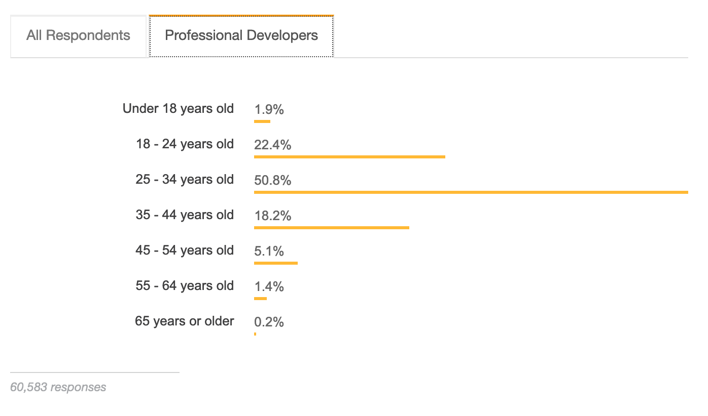
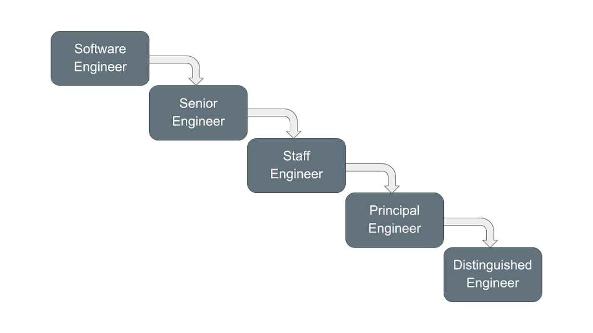

Now that the site is getting more feature complete and I have written a few articles, 
I wanted to explain in more depth why I chose &quot;The Aging Developer&quot; 
and what it means to me.

I came to a career in software, specifically product R&D, in a round-about way. 
I did not go to school for software engineering or computer programming. I did 
not intern for a software company. I had some basic computer training in 
middle & high school. My intro engineering class used Fortran, and I took the 
odd RPG or Microsoft access class through continuing education. Development was
not my original focus, but I had always had an interest in it. 

Shortly after leaving college, I didn't really have any kind of career lined up.
I had been working physical temp jobs and landed steady work at 
[Tone's Spices](https://www.tones.com/about) in inventory control. After a 
few years there, I was able to use my skills somewhat by hacking MS Office with 
VBA. 

Through continuing education and self learning I was able to move into 
an *IT* position. This is when I started to get interested and involved in the 
open source community, more specifically [Mozilla](https://www.mozilla.org). 
I was participating regularly in that community, including writing extensions. 
It was that extension writing that got me noticed by the Netscape division of 
AOL. I was hired there to develop [Netscape Navigator 9](https://en.wikipedia.org/wiki/Netscape_Navigator_9). 
It was a big leap of faith that I would be able to do it. And that is when 
my career in software development really took off.

Once I had landed in R&D for a while, it became obvious to me that I was older 
than my colleagues. First at [AOL](https://en.wikipedia.org/wiki/AOL) then 
subsequently at [Workiva](https://en.wikipedia.org/wiki/Workiva). It was not by a lot, 
but by enough for me to notice. I am often the senior in the room by around ten years. 
My assumption is that my career start was a contributing factor in this.

The software industry skews much younger. The median age of 
[Google and Amazon employees is 30](https://www.payscale.com/data-packages/top-tech-companies-compared/tech-salaries).
A 2018 Stack Overflow survey of 100,000 programmers around the world found that 
[three-quarters of them were under 35](https://insights.stackoverflow.com/survey/2018#developer-profile-age). 

Meanwhile, the median age of [American workers is 42](https://www.bls.gov/emp/tables/median-age-labor-force.htm),
and I just turned 44...

The age difference makes you wonder what happens to those older developers. From
my expereince there is a constant push towards management. Until recent history 
a lot of software companies did not have career paths for developers that did 
not want to move into management. This has been changing for larger software 
companies like Microsoft, Apple, Google, and others. Workiva is one of these 
companies that now has career tracks that stays technical.

I was one of those engineers that had ended up on a management path without really 
giving it a lot of thought. Some internal restructuring and a new manager gave 
me the space I needed to reevaluate what I wanted for my career. That led me 
back to a technical focused path. I did not mind managing people and I really 
liked the relationships, especially being able to be a mentor to the people that 
reported to me. I just always enjoyed the code more.  

Being largerly self taught, already older than a lot of my colleagues, and in a 
career that does not have many older people does produce a fair bit of anxiety.

* Is this something I can do until I retire?
* Can I stay technically proficient?
* Can I keep a relevant skill set?
* Does it make sense for the company to replace me with someone younger?
* ...

Some of the doubts that I have can be chaulked up to imposter syndrome. 
[Impostor syndrome](https://en.wikipedia.org/wiki/Impostor_syndrome) is doubt 
in your accomplishments or talents and a fear of being exposed as a "fraud". 
Despite all evidence to the contrary. But it could be legitimate fears.

I started this site as a way to keep updating my skills. The tech stack that I
picked was one I'm not familiar with so that it allows me to broaden my knowledge. 
This helps ensure that my skill set does not get outdated. 

I chose a public site to be visible. I wanted to do some work that others outside 
of large enterprises would see again. It allows me to engage with the general 
public and network with other. 

It is open source so that if others feel like they could contribute to the 
discussion; they are free to do so with little hindrence. It can also be a 
platform where you, as a developer, can be seen and heard. Although, I don't
have a large audience yet ;)

The Aging Developer can be a place for others going through the same sorts of 
worries and feeling to realize they aren't along. That others share the same 
fears and hopefully the act of sharing can diminish those fears.

That is why "The Aging Developer".

----
Reference:

* [Ctrl-Alt-Delete: The Planned Obsolescence of Old Coders](https://onezero.medium.com/ctrl-alt-delete-the-planned-obsolescence-of-old-coders-9c5f440ee68)
* [Hacker News: What happens to older developers?](https://news.ycombinator.com/item?id=7372997)
* [No place for the old? Is software development a young person's game?](https://www.techrepublic.com/article/no-place-for-the-old-is-software-development-a-young-persons-game/)
* [Where do all the old programmers go?](https://www.infoworld.com/article/2617093/it-careers-where-do-all-the-old-programmers-go.html)
* [As A Software Developer, How Can I Ensure I Remain Employable After Age 50?](https://www.forbes.com/sites/quora/2012/09/17/as-a-software-developer-how-can-i-ensure-i-remain-employable-after-age-50/#6ab73da57264)
* [Software Development Career Paths](https://simpleprogrammer.com/software-development-career-paths/)
* [Job Titles & Levels: What Every Software Engineer Needs to Know](https://www.holloway.com/s/trh-job-titles-levels-fundamentals-for-software-engineering)
  
