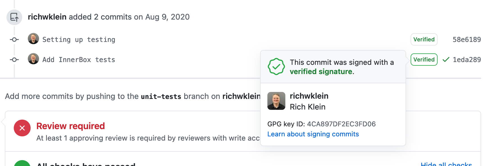

  
I recently had to completely reinstall the OS and all software on my personal computer. I had to go back and set up my development tools including SSH and 
GPG keys. I do this just infrequent enough that I had to review the documentation on how to do it. So I figured it would be worth while to put together this article to help others as well.

## Why Sign Git Commits

When you make a commit in Git the author information is sent along in the form of a name and email address. This information by itself is not verified in anyway. It is just a way to see who you are collaborating with. It is easy to impersonate someone by simply providing the same name and email address since that author information is not vetted in any way. The impersonation could happen in any repo regardless of your knowledge. In the worst case scenario someone could do this in one of the repositories that you regularly work in which would be extremely difficult to detect.

Git commit signing is a way to put a signature on a commit to show that the commit is actually coming from you.

## How Commit Signing Works

Commit signing uses a public/private key pair to verify where the commit comes from. When making the commit you sign it with your private key. Others can then use your public key to verify the signature on the commit.

## Getting it Setup

These instructions will be for macOS, but it should be pretty similar to set this up on other Operating Systems.

1. Git uses GPG for signing. I use [GPGTools](https://gpgtools.org/) for this, but you can choose your own [command line tool](https://www.gnupg.org/download/).

2. Generate a GPG Pair from the command line.

```shell
% gpg --full-generate-key
```

* **RSA and RSA** is the default key pair. You can just select that one. 
* Select the key size (*4096* is a minimum for github). 
* Select how long the key should be valid for. The default is to never expire.
*. Provide your Name, Email Address, and a Comment. The email address must be the same as your github account.
* Supply a passphrase. You could leave this blank, but I would supply it. You can always store it in the *GPG Keychain* so that you will not have to supply it on every commit.

3. List out your keys and select the key id of the one you just generated. It will be the string after the / on the sec line.

```shell
% gpg --list-secret-keys --keyid-format LONG

gpg: checking the trustdb
gpg: marginals needed: 3  completes needed: 1  trust model: pgp
gpg: depth: 0  valid:   1  signed:   0  trust: 0-, 0q, 0n, 0m, 0f, 1u
/Users/richard/.gnupg/pubring.kbx
---------------------------------
sec   rsa4096/0QB348777C85D1CC 2021-02-05 [SC]
      453372F6E3A6E764B2EC8EFB0BB938777C85D1CC
uid                 [ultimate] Rich Klein (Git Signing) <richwklein@gmail.com>
ssb   rsa4096/EC054AC0385BCD63 2021-02-05 [E]
```

4. Configure git with your signing key

```shell
% git config --global user.signingkey 0QB348777C85D1CC
```

Now you should be able to sign individual commits by supplying the `-S` to your git commit command. I prefer to have all my commits signed, so I configure git to always do this. 

```shell
% git config --global commit.gpgsign true
% git config --global tag.gpgSign true
```

After making a commit you can verify it was signed using the log command.

```shell
% git log --show-signature -1
```

5. Export your public key

Signing your commits is only part of the process. Others can not verify the commit until they have your public key. So next you'll need to export it.

```shell
% gpg --armor --export 0QB348777C85D1CC
```

This will print out the **ASCII** version of your key. If you are using github then this is what you upload to your user profile so that they can verify your signatures.

6. Upload your public key. 

* Go to the github [keys](https://github.com/settings/keys) page.
* Click on the *New GPG key* button.
* Paste your key from the previous step in the box.
* Click on the *Add GPG key* button.
* Fill in your password.

Your commits are now signed and you can see the verified badge on commits in github.



## Official Documentation

I used the following documentation to set up my signing and create this article.

* [Git Tools - Signing Your Work](https://git-scm.com/book/en/v2/Git-Tools-Signing-Your-Work)
* [Github - Generating a new GPG key](https://docs.github.com/en/github/authenticating-to-github/generating-a-new-gpg-key)
