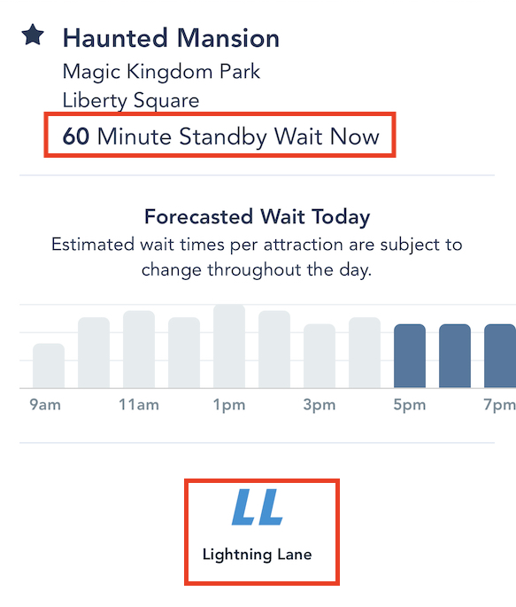
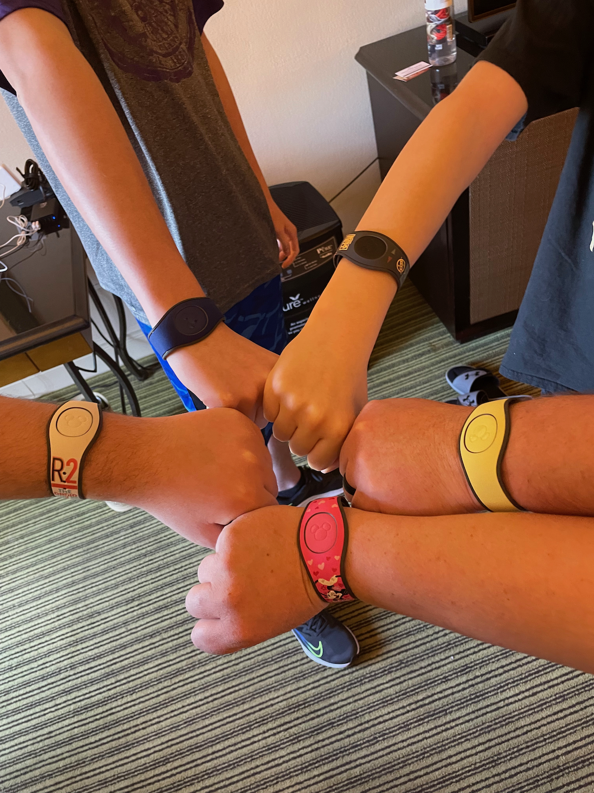
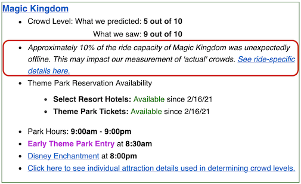

We had a cruise planned for our family vacation in February. Since we were flying to Florida anyway to get on the cruise 
ship, we decide to extend our vacation for a few days and go to Disney World as well. This family of 5 has been to 
Universal Studios a few different times, which we've loved. Rachel and I had been to Disney World twenty some years 
ago, but we've never been to any of the Florida Disney parks as a whole family. Since we extended the trip for two days 
we decided that we would go to the [Magic Kingdom](https://disneyworld.disney.go.com/destinations/magic-kingdom/) and 
[Hollywood Studios](https://disneyworld.disney.go.com/destinations/hollywood-studios/) theme parks. As with any 
vacation, I would do again. However, we were disappointed in the overall experience and wanted to share with others. Our 
second day at Hollywood Studios was much better than Magic Kingdom, but wasn't without its problems.

## Cost

As a family of five we knew that this experience was not going to be cheap. The cost of the tickets to get into the park 
vary based on the day. Our cost was roughly $140 per day per person. So the upfront cost to walk through the gates was 
around $1,400. Since this was an expected cost, it really wasn't one of our main issues. The systemic additional 
expenses since the park charges for virtually **everything** was an issue. It is a thread you will see running 
throughout the rest of this article.  

## Lightning Lanes

There are two basic types of queues / lanes available for rides at the parks: "Standby" and "Lightning Lanes". Standby 
lanes are your traditional queues where you just wait in line for the ride. The Lightning Lanes bypass large sections of 
the Standby lane, but you must first get a pass and wait in a virtual queue until it is your time to go to the ride. The 
Disney app shows the lane information for each ride.

  </img>

The "Lightning Lanes" can save you a lot of time, but you can't just access them. There are two types of passes 
available to gain access to these queues, [Genie+](https://disneyworld.disney.go.com/genie/?int_cmp=INS-intWDWtoWDW-Genie) 
or paying for individual passes. Genie+ is the replacement for the old Fast Pass system. The Genie+ service is $15 per 
person per day and gives you Lightning Lane access to a selection of attractions per park (excluding all the tent pole 
rides you really want access to) :(. 

A major caveat and drawback of the service is you can only have one Genie+ pass active at a time. That means that if 
it is 9am and a select a pass that is for 1pm then you can not make another selection until after 1 o'clock. The time
slots for these passes fill up fast as well.

The only way to gain lightning lane access to the crowd favorite rides like "Star Wars Rise of the Resistance" or "Seven
Dwarfs Mine Train" is to pay for individual passes.

We were going to be there the weekend prior to presidents day weekend. The forecasted crowds were not suppose to be 
*that bad*, 5 and 6 on a scale of 1 to 10. Since we were only going to be at the parks for two days, we knew that we 
would have to minimize our wait times regardless of crowd size if we were going to be able to ride the most iconic 
rides. We opted into purchasing Genie+ for everybody ($150). The initial plan was to not buy any of the individual 
passes. 

The lightning lanes require scanning your admission ticket to make sure it is your turn to enter the attraction. Our 
tickets were emailed to us, which we could access through the Disney app on the phone. If we were to use the app to 
scan the tickets at each of the Lightning Lanes I would have had to swipe through 5 different tickets each time and we 
would not have been able to split up. We opted into purchasing magic bands, roughly $30 each, for everyone instead. 
These bands could be used at the gate and at each attraction for the Lightning Lanes.

  </img>

I don't really feel like Genie+ was worth it for us. We were only able to use it twice each day. The second day we had 
hoped to book a pass through Genie+ for Tower of Terror, but by 10 o'clock in the morning the time for the ride was 
already late at night. Although, we hadn't planned on purchasing individual Lightning Lanes, the crowd levels were much 
high than anticipated so we did end up buying them for three rides (another $285). 

## Maintenance and Disrepair

Splash mountain closed in January and it was suppose to open back up on the day that we were going to be at Magic 
Kingdom. It did eventually open that day; one hour before park close. That was a foreshadowing of the problems with 
attraction availability. When we first got to the park, we decided to take the Monorail in. The train we decided to take
was sitting on the track when we got up to it, but they wouldn't let us on right away. Eventually the operators did 
let us on just to ask us to get back off again. Apparently there was a problem with that particular train and they had 
to remove it from the rail and bring in a new one. So we started the day with roughly a 30 minute delay just getting
into the park. Space mountain is an iconic ride that we had wanted to do as a family. It was maybe open for a couple of
hours. We even paid for a [Lightning Lane](#lightning-lanes) to ride it, but when I time came around it was down again
and wasn't going to be open before park close. At one point while we were at Magic Kingdom the following rides were
all **temporarily closed**.

* Splash Mountain
* Space Mountain
* Big Thunder Mountain
* Pirates of the Caribbean
* Jungle Cruise

According to [Touring Plans](https://touringplans.com/) a full 10% of the attractions were unavailable that day.

  </img>

 The attraction availability issues pushed crowds to the other areas of the park making it super crowded. Hollywood 
 Studios was not immune to these issues either. Rise of the Resistance did not open when it was suppose to and shut down 
 for around three hours in the middle of the day. When that ride did reopen so many people had Lightning Lane passes, 
 including us, that it made the standby line irrelevant. Similar to 
 [this Disney Fanatic post](https://www.disneyfanatic.com/lightning-lane-left-space-mountain-standby-line-broken-tb1/?fbclid=IwAR0r0dv10KqBxBCZBP6XTrtJpqESliVPrXP1Qjc5Huk03XkBVnv30RytqSo)  

## Crowds

The forecasted crowd level for the day we were to be at Magic Kingdom was a *5*. Attendance was actually a *9*. This 
made it very hard to get around and made the lines for everything very long (2 hour lines were pretty common). The 
attraction operators on more than one occasion ask people to scoot closer together and "we would get on faster". I hate 
to break it to them, but that isn't how lines work. 

## Online Food Ordering

Disney really advertises and pushes for you to use the app to order the food online. We did this for the majority of our 
food, but we had some gift cards to use so we didn't do it for all of them. It was a disappointment that we couldn't 
load the gift card into the app and use those for the payment. The whole mobile ordering is just another queueing system 
in disguise. First the app asks you to press a button when you are close to the venue. Your order isn't actually 
submitted until then. The app will then give you a time to come back when your order will be ready. It also notifies you 
of the line to get into when that time comes. Your order isn't actually ready when you are notified either. When you get 
to the window / person is when your order is actually put together.

Aloha Isle is the only place in Magic Kingdom where you can get a Dole whip. It is also a spot in the park with terrible 
mobile and wifi reception. When trying to order the Dole whips we spent over an hour from order to pick up time.

## Returning

If you look online, you will find a growing list of people unhappy with the way Disney is handling their parks. I think 
overall our family has enjoyed Universal Studios much more. So I think we would be more inclined to return there 
instead of Disney. I would return to Disney again, but would like to see them make some changes first. The Genie+, 
individual Lightning Lane purchases, and mobile food ordering all feel like broken experiences that need to improve. 
