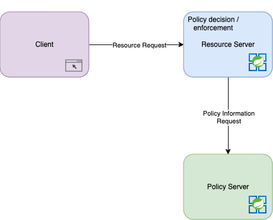

This article is the exploration of distributed authorization using the [Casbin](https://casbin.org) library. It is a follow up from a 2022 [article](2022-06-18-distributed-authorization) I published. In the previous article, I detailed various access control models, the parts of an authorization system, some typical patterns you see in those systems, and the pros and cons. This article is a promised follow up article using [Casbin](https://casbin.org).

<Alert variant="outlined" severity="warning">The code and and recommendations in this article has not been tested in a real production environment.</Alert>

## System Architecture

I will be using some terms to describe the overall system architecture. Some of these terms come from the the [OAuth 2.0 RFC](https://www.rfc-editor.org/rfc/rfc6749#section-1.1) and the [XACML 3.0 Standard](https://docs.oasis-open.org/xacml/3.0/xacml-3.0-core-spec-os-en.html). Most of these terms were used in previous articles.

<dl>
  <dt>Resource Server</dt>
  <dd>The server hosting the protected resources.</dd>
  <dt>Policy administration point (PAP)</dt>
  <dd>The system entity that creates a policy or policy set.</dd>
  <dt>Policy decision point (PDP)</dt>
  <dd>The system entity that evaluates applicable policy and renders an authorization decision.</dd> 
  <dt>Policy enforcement point (PEP)</dt>
  <dd>The system entity that performs access control, by making decision requests and enforcing authorization decisions.</dd>
  <dt>Policy information point (PIP)</dt>
  <dd>The system entity that acts as a source of attribute values.</dd>
</dl>

The system I'm going to design will use a **Local Decision / Centralized Policy** pattern where the Policy decision and Policy enforcement points will reside within the Resource Server and there will be a central server responsible for the Policy administration and Policy information points. These services will be built using Java 21 and Spring Boot 3.x.



In these examples our Resource Server will be a "Research Paper" service where people will be able to upload their papers, get the papers reviewed, and read each others papers. Our server could be horizontally scaled where there could be multiple instances of it. In a real world system there could be lots of different kinds of resource servers deployed as part of an overall system. 

## Domain Logic

The core of the "Research Paper" service is it's domain model and services. I typically subscribe to some form of <abbr title="Domain Driven Design">DDD</abbr> and [Hexagonal Architecture](https://en.wikipedia.org/wiki/Hexagonal_architecture_(software)), but since this is an example project the code will not be as strict in layout and design as it would normally be.

### ResearchPaper

Our core model will be the `ResearchPaper` this is what a user can submit, be checked out, and reviewed.

## Authentication

The main focus of this article will be on Authorization / Access Control. One of the first steps in any type of authorization check should be to first establish if the request is authenticated. In my example I'm going to have all endpoint require a user to be authenticated. That is not something I'm going to code though. That responsibility will be left up to Spring Security and Okta. Baeldung has a great [tutorial](https://www.baeldung.com/spring-security-okta) using the `okta-spring-boot-starter` to authenticate requests.

## Casbin Basics

[Casbin](https://casbin.org) is an authorization library that supports modeling various types of access control mechanics, including: <abbr title="Access Control List">ACL</abbr>, <abbr title="Role Based Access Control">RBAC</abbr>, <abbr title="Attribute Based Access Control">ABAC</abbr>, and others. This library was original developed in the Go language, but has several different ports including <a href="https://github.com/casbin/jcasbin">jCasbin</a>, a java version, which we will be using in this article. 

The library works on two sets of data to determine authorization. The first piece of data is the access control model that has been defined in a <abbr title="Policy, Effect, Request, Matchers">PERM</abbr> metamodel. The second set of data is the stored policy data / information.

### Model

The access meta model or *model* is is how you define the type of access control that will be enforced. Below is the model used to define a very basic ACL.

```conf
# Request definition
[request_definition]
r = sub, obj, act

# Policy definition
[policy_definition]
p = sub, obj, act

# Policy effect
[policy_effect]
e = some(where (p.eft == allow))

# Matchers
[matchers]
m = r.sub == p.sub && r.obj == p.obj && r.act == p.act
```

__The first section is the *Request definition*__. This defines the parameters of a request. The parameters will then be used by the rest of the sections to determine how the access control is enforced. This request definition is a tuple consisting of the "Subject" making the request, the desired "Object" being requested, and the "Action" being taken on the object.

__The second section is the *Policy definition*__. This defines the name and order of the fields in the [Policy](#policy). The policy definition in this ACL model is "Subject", "Object", and "Action". Additionally, the "Effect" could result could be defined as well. If effect is not included then the result will be allow by default. In Casbin the *Policy* is the policy information or policy data. 

```
alice,doc1,write
alice,doc1,read
bob,doc1,read
```
These policies show that alice can read and write the object "doc1" while bob can only read that object.

__The third section is the *Policy effect*__. This returns a boolean value if the "Action" should be allowed based on the matched [Policy](#policy). In the above model the request would be allowed if some matched policy effect is to allow. Consider another effect:

`e = some(where (p.eft == allow)) && !some(where (p.eft == deny))`

In this case the "Action" would be allowed if there is a matched allow policy and no matched deny policy.

__The last section is the *Matchers*__. This defines how Policy gets matched to a Request. In the above model the Policy would match if the Request "Subject", "Object", and "Action" match the "Subject", "Object", and "Action" in the policy.

### Policy

