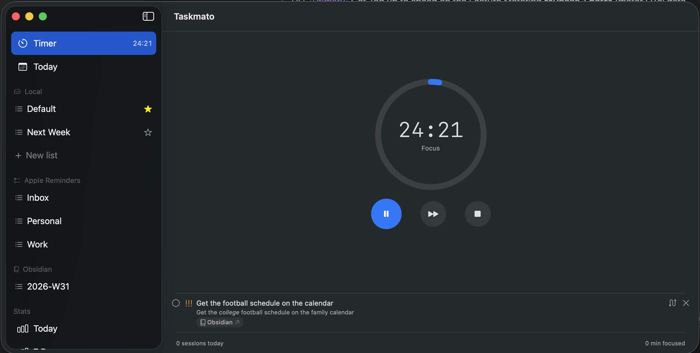
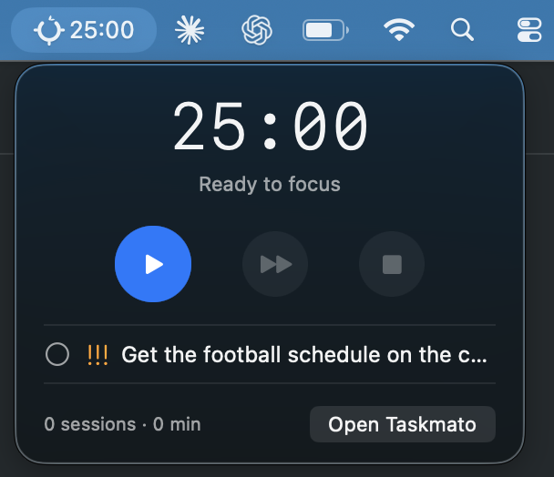
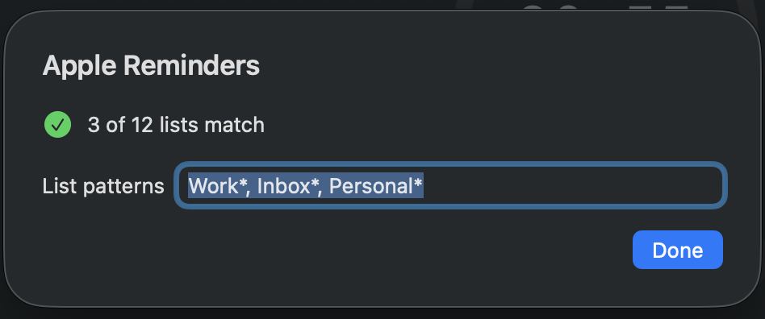
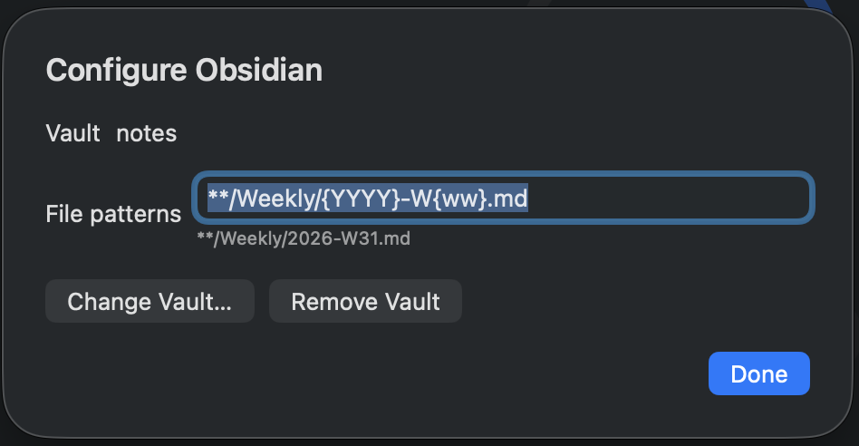
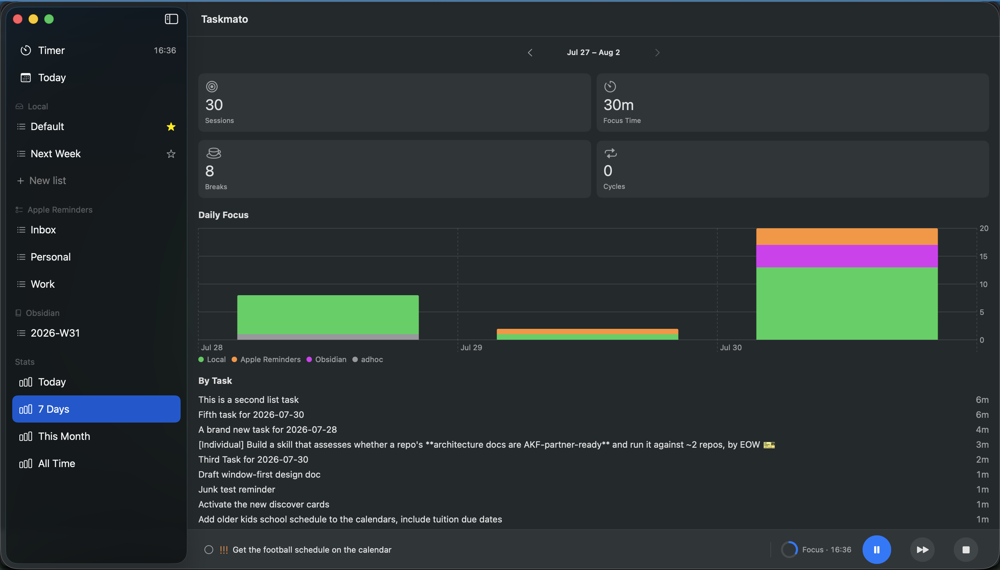

I have used the [Pomodoro Technique](https://en.wikipedia.org/wiki/Pomodoro_Technique) on and off for years. When it works, it works because it is small. Pick one thing, work on it for twenty-five minutes, stop before your attention decays too far, then decide what comes next.

The hard part is not the timer. The hard part is choosing the thing.

For a long time that thing lived in [Todoist](https://www.todoist.com/). I kept work and personal tasks there, and used an app then known as PomoDone, now [RoundPie](https://theroundpie.com/), to attach Pomodoro sessions to Todoist tasks. It was the right shape for how I worked: the timer did not ask me to maintain a second task list. It sat next to the list I already trusted.

Then the integration stopped working. I tried alternatives. Some were polished but too opinionated. Some were timers with a task text box bolted on. Some wanted to become an entire productivity method.

What I wanted was simpler: pick a real task, start a timer, and leave the task where it already lived.

So I started building one.

The first version of [Taskmato](https://github.com/richwklein/taskmato) was a <abbr title="Material UI">MUI</abbr> and <abbr title="React JavaScript library">React</abbr> application that connected to Todoist. The old app was more functional than it now appears from the outside, but [taskmato.com](https://taskmato.com/) currently stops at the Todoist API-key screen unless you provide credentials. It was making progress toward the itch, but not complete enough to scratch it before I pivoted. It also inherited a problem from its dependency. If my tasks lived in Todoist, Taskmato lived in Todoist too.

Then Todoist raised its Pro pricing, and I left.

My tasks now live mostly in Apple Reminders. My project notes live in Obsidian. Those notes contain checklists, dates, and the surrounding context that rarely belongs in a task manager. The old Taskmato could not follow me there. It was tied to a particular SaaS API instead of the way I actually organize work.

The 1.0 pivot is to make Taskmato a task-provider app.

## What Changed

Taskmato is now a native macOS app written in Swift. It has a main window, a menu bar extra, and a Pomodoro session engine. The menu bar shows the countdown and a compact control surface.

The window is where the real work happens: selecting tasks, configuring providers, and looking at stats.

The split was a deliberate late change. Menu-bar-only apps are tempting early on because they feel lighter. For a simple timer, that is enough. Taskmato stopped being only a timer once it had multiple task sources, list scoping, setup screens, completed-task views, and stats. A tiny popover is a poor home for that much state.

The current shell treats the window as primary and the menu bar as a companion.

This seems mundane, but it simplified the application. There is no longer a full-featured popover and a full-featured window trying to stay equivalent. There is one primary surface and one glanceable surface.

## Bring Your Own Task Source

The most important design decision in Taskmato is the provider model. A task source is not assumed to be writable, closable, cloud-backed, or even structured the same way as another source. Providers declare what they can do.

The built-in providers for 1.0 are intentionally local-first:

- **Local** stores lists and tasks in a JSON file under Application Support.
- **Apple Reminders** reads incomplete reminders through EventKit and can mark them completed again in Reminders.
- **Obsidian** scans Markdown files in a vault, parses task lines, and rewrites checkboxes in place.
- **URL scheme** support lets scripts and launchers start a session with `taskmato://start?title=...`.

The local provider is the boring baseline. It is fully writable and requires no external setup. It also gives Taskmato somewhere to put ad-hoc tasks when a URL starts a session for something that does not already exist elsewhere.

Apple Reminders is where my day-to-day tasks live now. Taskmato can filter Reminder lists with glob patterns, so I can include only the lists that matter for focus work instead of dragging every household or shared list into the app. When a focus session ends, completing the task can write back to Reminders. The source of truth stays the source of truth.

Obsidian is more interesting because the data is just text. Taskmato stores a security-scoped bookmark to the selected vault, scans matching Markdown files, and parses the common Obsidian Tasks emoji syntax for priorities and dates. File patterns can include date tokens such as `{YYYY}`, `{MM}`, `{ww}`, and `{DD}`, which means the provider can be scoped to daily notes, weekly planning files, or project folders without requiring the whole vault to become a task database.

The Obsidian provider watches the vault using FSEvents. Change a task in Obsidian and Taskmato sees it. Complete a task in Taskmato and the Markdown checklist line changes from unchecked to checked. The native ID for a Markdown task is the file path plus line number, with a fallback scan when the line number has gone stale. Text-file integrations need this kind of ordinary, careful plumbing.

It also creates Obsidian deep links, so a task can take me back to the note that explains why the task exists.

The task view has to make those sources feel coherent without hiding where they came from. Tasks can be shown as a dense list or as cards, depending on how much scanning versus reading I am doing. The detail view has limited Markdown support for task titles and notes, enough for links, emphasis, and Obsidian-flavored task text without turning the app into a Markdown editor. Providers that support completion can also surface completed tasks inline, which is useful when I need to reopen something or check what I just finished.

## Capability, Not Uniformity

The provider abstraction could have been one large protocol: every provider lists tasks, creates tasks, completes tasks, reopens tasks, deletes tasks, manages lists, and reports completed items. That would have been convenient for the caller and dishonest for the providers.

Markdown files do not behave like EventKit reminders. A local JSON store does not need authorization. Some future providers will be cloud APIs with OAuth, rate limits, and remote failure modes. Pretending those all have the same capability surface pushes complexity into runtime errors.

Taskmato uses a layered model instead:

- `TaskProvider` can list tasks and observe changes.
- `ClosableTaskProvider` can complete and reopen tasks.
- `WritableTaskProvider` can create tasks and manage lists.

The UI follows those capabilities. The add button appears only when the current provider is writable. Completed-task affordances appear only when a provider can close tasks. If a provider does not promise a behavior, the interface never offers the control.

This is the architecture I wish the first React version had. The first version was a Todoist timer. The Swift version is a timer with task providers.

## The Timer Is a State Machine

The Pomodoro engine is deliberately separate from the task providers. It knows about phases: focus, short break, long break, paused, idle. It does not know how Apple Reminders works or how Markdown is rewritten.

Time is computed from wall-clock timestamps rather than from a counter that decrements once a second. That matters on macOS because laptops sleep and apps get backgrounded, so a naive counter will drift. A countdown that says "seventeen minutes left" because the process missed ticks is lying. Taskmato stores when the phase started and derives the remaining time from the current clock.

Completed phases are appended to a session log with the selected task reference. Stats are projections over that log rather than counters sprinkled around the UI.

This gives the app a useful audit trail: focus minutes by task, by provider, by day, and eventually richer rollups. The menu bar footer can already show focus count, minutes, and streak because those values are derived from the same session data the Stats tab uses.

## Agent-Built, Human-Directed

I am new to Swift. Taskmato is larger than the kind of Swift project I would normally choose as a first serious macOS application. A lot of the code was built with agent harnesses under my guidance.

It is a strange sentence to write because it can sound like I am disclaiming authorship. I am not. The product decisions are mine: local-first free providers, a single window, a slim menu bar companion, no subscription, a one-time Pro unlock later for cloud providers, and a provider model that follows my task systems instead of replacing them.

The agents helped turn those decisions into working Swift.

Writing this way changed the project. I used architecture decision records more heavily than I would in a small personal app. The ADRs explain why providers are layered, why JSON persistence is enough for the MVP, why the menu bar stopped being the primary UI, and why future cloud providers will sit behind one non-consumable Taskmato Pro purchase instead of a subscription.

Those documents are memory for the next agent session and for future me. When an agent starts changing a design, it needs something more durable than "I think we talked about this last week." ADRs give the project a spine.

## What 1.0 Means

Taskmato has a narrow job. It should sit beside a task manager, a notes app, or a personal productivity system without trying to replace them. Plenty of apps already handle website blocking, social accountability, soundscapes, badges, and new task methodologies.

The 1.0 promise is narrower:

- Run a Pomodoro cycle from a native macOS app.
- Keep the countdown visible in the menu bar.
- Attach focus sessions to real tasks.
- Let tasks come from Apple Reminders, Obsidian, or a local JSON list.
- Write completion back when the provider supports it.
- Keep enough session history to show where focus time went.

This is enough because the point is not to move my life into Taskmato. The point is to let Taskmato sit beside the places where my life already is.

## After 1.0

The roadmap after 1.0 keeps following the same constraint: Taskmato should meet tasks where they already live.

The first step is making more of the local providers writable. Today Apple Reminders and Obsidian are useful for selecting and completing existing tasks. The next step is creating new work in the same source system without falling back to the local JSON list.

After that, the provider list gets wider. [Things 3](https://culturedcode.com/things/) is the obvious local-only addition. Cloud providers — I am thinking Todoist, Linear, TickTick, Notion, Google Tasks, GitHub Issues, that kind of thing — belong behind a one-time Taskmato Pro unlock because they bring ongoing API and OAuth maintenance. The free providers should remain useful on their own; Pro is for people whose tasks live in cloud systems.

Todoist may come back to Taskmato, but in a different role. It will be one provider among several. The product no longer depends on it.

The marketing site is currently at [richwklein.github.io/taskmato](https://richwklein.github.io/taskmato/). The old [taskmato.com](https://taskmato.com/) domain still points at the earlier Todoist experiment, but it will move once the release site is ready.

**Personal software should survive workflow changes.**

The first version broke when my task system changed. The new version assumes that it will change again.
