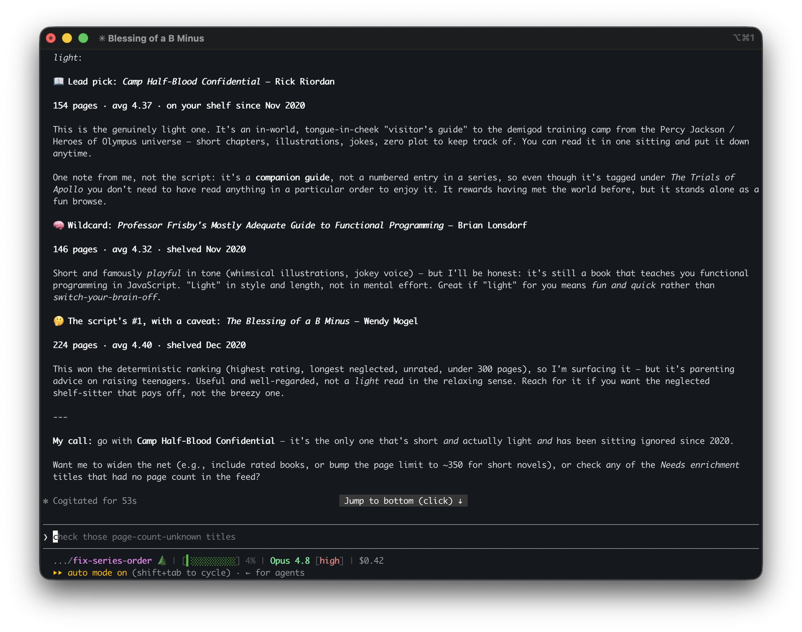
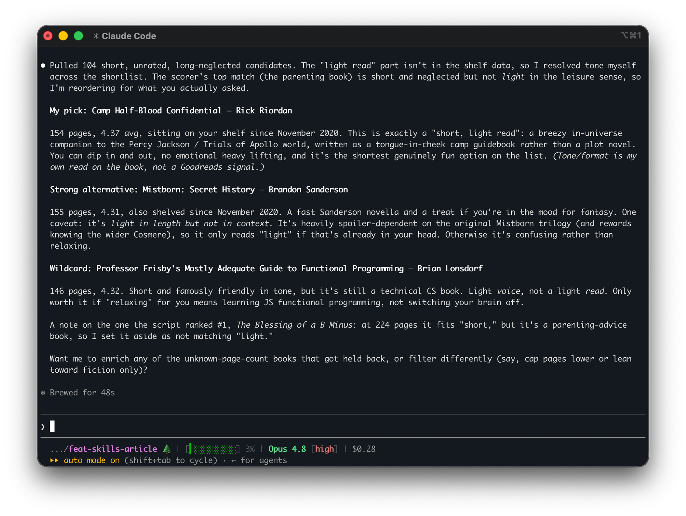

A few months ago, I moved my drift-detection skill out of my repo templates and into a central [`richwklein/skills`](https://github.com/richwklein/skills) repo. I [wrote about that migration](/article/2026-05-23-repo-template-experience) at the time, and I ended it with a small promise: the central repo "gave me a home for the next skill I build."

Two skills have moved in since. Neither is about templates. One resizes images. The other picks my next book.

Both install the same way the audit skill does:

```bash
npx skills add richwklein/skills
```

## Prepare Image

This blog has its own rule for images. The README says cover images should be _1920px_ wide so they hold up as raw social-media previews. That number is not universal. I have a few projects, and each one wants a different maximum dimension for the images it ships. I knew each rule, but I still had to remember to adjust every image by hand.

`prepare-image` reads the rule instead of relying on me to remember it.

```text
/prepare-image <source> <output-name> [--width N] [--max-kb N] [--dir path] [--format jpeg|keep]
```

Before it does anything, the skill checks the current repo's `README.md` and `AGENTS.md` for documented image constraints: the dimension first, then output directory and format. In this repo it finds the 1920px rule on its own. In another project it finds that project's number instead. The skill carries the behavior; the repo carries the policy.

The rest is mechanical. The skill honors EXIF orientation so portrait photos are not sideways, resizes to the repo's width, and re-encodes as a clean JPEG with mozjpeg. It reports the final path, dimensions, size, and quality. How much file size matters depends on the project. This blog lets Astro optimize the images again at build time, so width is what I care about here. Another of my projects has no such step and requires every image to land under 100 KB, so there the size budget is the whole job. The skill handles both cases. It resizes to the documented width, then lowers JPEG quality as needed when the repo sets a size limit.

It can also check a directory instead of changing one. `--check` flags any image that is the wrong width or too large:

```text
/prepare-image --check --dir content/article/2026/08-30-home-for-the-next-skills
```



The one habit I built into it is a preview. Before writing a file, it shows me a parameter table and waits for confirmation. I require that of every write-capable skill in the repo. Once I approve the parameters, I can let it run without babysitting it. The skill uses `sharp` from the host repo's `node_modules`, so it runs the version the project already pins rather than relying on a global install.

## Goodreads Next Book

The second skill has nothing to do with code. Right now I am 790 pages into Joe Hill's 896-page [King Sorrow](https://www.goodreads.com/book/show/223420465-king-sorrow). I have been at it for three months, and I should finish in the next week. When I do, I am going to want a palate cleanser: something light I can breeze through.

I have tracked my reading on Goodreads for years, both the books I have finished and the ones I mean to get to. My **Want to Read** shelf is almost 300 books long. At that size, finding the right book for a particular mood means sorting through more options than I want to compare by hand.

I wanted to describe my mood in plain language and get back a few good ideas from that shelf. I looked for a skill that already did it, found nothing, and built one.

`goodreads-next-book` answers one question from that shelf: "What should I read next?"

```text
next-book [user-id | RSS URL] [--genre NAME] [--min-rating R] [--max-pages N] [--prefer neglected]
```

I can ask it naturally. Once I finish King Sorrow, "a short, light read I've been ignoring" becomes:

```text
next-book --max-pages 300 --prefer neglected
```

Page count becomes a hard filter; shelf age becomes a preference. Whether a book feels "light" is a judgment call, so the script leaves that to the agent.

What I like about this one is how the work is split. A deterministic Python script does everything that should be exact and repeatable: it pages through the entire shelf over RSS, applies the hard filters (genre, author, rating, page count, publication year, date added), and scores what survives. Shelf age can become a first-class signal when I ask for it, which helps surface older additions instead of defaulting to the book I added on Tuesday. The script returns a short list: a best match, an alternative, and a wildcard.

The agent picks up where structured data runs out. Requests like "a light vacation read," a book's tone, and audiobook quality do not live in an RSS feed. The agent evaluates those criteria only for the short list, using Open Library and then the web instead of working through the whole shelf.



A recent update moved one task from agent judgment into the script. I read a lot of series, and I do not want a recommendation for book four when I have only finished book two. Goodreads includes the series name and number in the title, such as `(Series Name, #4)`, so the order does not require judgment. The script now parses that marker and checks my **Read** shelf to see how far I have gotten in each series. If a candidate comes later in a series than I have reached, the script demotes it and points me to the earliest unread book instead. The agent handles the exceptions the marker cannot capture: companion volumes, sub-series with different names, or books I read somewhere other than Goodreads.

Two other details mattered enough to make explicit. The skill translates raw source codes into plain language before they reach me, so I get "free to borrow online, one copy at a time" instead of an Internet Archive access enum. Because a full shelf URL can contain a key for a private shelf, the skill treats that URL as a secret: it never logs or commits it.

I also set `GOODREADS_USER_ID` once, so I never have to pass my ID by hand. My `.zshenv` sources a global `.env` file, which makes the variable available in every shell for the script to read. Loading that file is the shell's job, not the skill's. I want to keep that responsibility out of the script.

## The Pattern Underneath

I did not set out to build two skills that rhyme, but they do.

Both draw a line between exact work and judgment. In `prepare-image`, the script handles the pixel math while the agent reads the repo's rules and confirms what I want. In `goodreads-next-book`, the script filters and scores the shelf while the agent interprets requests such as "light" or "neglected." The model does not do arithmetic, and the script does not pretend to have taste.

They also keep my settings outside the reusable code. `prepare-image` reads image rules from the project. `goodreads-next-book` gets my identity from the environment and my preferences from the request. That keeps the skills reusable without baking my choices into them.

The safeguards match the work. A skill that writes files previews its changes. A skill that handles a private shelf URL does not expose it. Both report their results in plain language.

## What the Repo Is Now

Three skills in, `richwklein/skills` has stopped being a home for one tool and become a small personal library. When I catch myself doing the same fiddly thing by hand for the third time, the repo is the obvious place for a fix I can reuse wherever I need it.

Not everything earns a spot. A skill has to be useful in more than one project or valuable enough to share publicly. Anything narrower stays in the repo where it is used. `prepare-image` meets the first test; `goodreads-next-book` meets the second.

The scheduled-audit idea from the last post is still on the list. In the meantime, the next skill already has a home, and so does the one after that.
