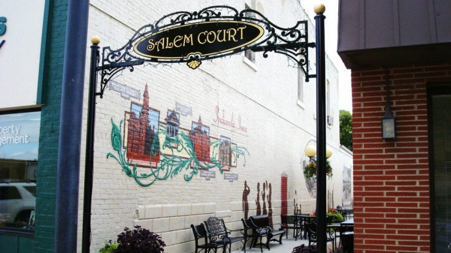
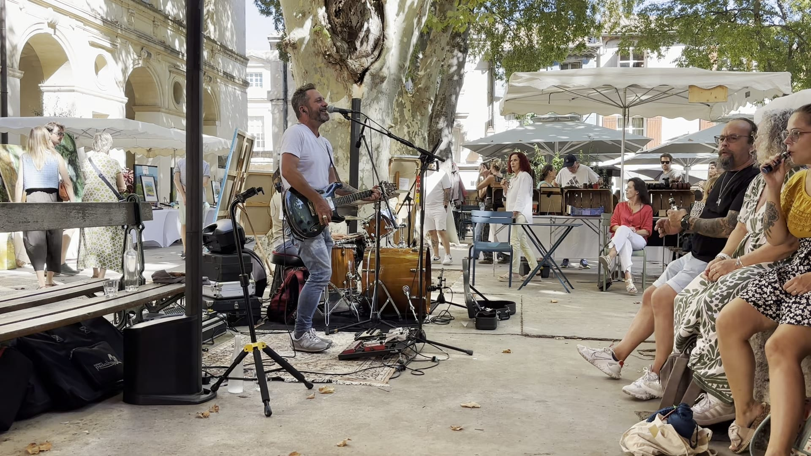

We recently returned from a trip to France. This was our third trip to Europe, and I keep noticing how people gather in the town centers. Restaurants line the squares with outdoor seating, and people sit and enjoy each other's company. We had lunch in Saint-Rémy-de-Provence while a solo musician performed popular songs in a mix of English and French. It was fairly busy, and I enjoyed being part of it.

We could use more places like that in our own communities. There are probably some that I've overlooked, too. The trip got me thinking about why these places matter and why I don't spend more time in them myself. A place like that only works if people keep showing up, and I'm not sure I do.

## Third Places

Sociologist Ray Oldenburg described these kinds of gathering places as **third places** in his book _The Great Good Place_, published in 1989. Home is the first place and work is the second. A third place is somewhere outside those two where people gather informally and get to know each other.

In an [essay written with Karen Christensen](https://www.unesco.org/en/articles/third-places-true-citizen-spaces), Oldenburg cites cafés, taverns, libraries, and hair salons. People can come and go, the cost is manageable, and regulars welcome newcomers. Conversation is a large part of what happens there.

A square can have several places where people gather this way. Markets and concerts bring people into the area, but getting to know each other takes more than attending an event. It takes spending time together regularly. We need more places that encourage that, and we need to make better use of the ones we have.

## Less Time Together

We also spend less time in these places than we used to. Using the American Time Use Survey, [Enghin Atalay at the Philadelphia Fed found](https://www.philadelphiafed.org/the-economy/macroeconomics/how-time-spent-alone-in-the-us-has-changed-over-the-past-two-decades-and-implications-for-well-being) that the share of free time Americans spent with other people outside the home fell from 21.9 percent in 2003 to 17.3 percent in 2019, then to 12.3 percent in 2020. Most of that decline happened before the pandemic.

Robert Putnam was making a version of this argument in _Bowling Alone_ in 2000, before most of that data existed, when he tracked how club and league membership fell off after the 1970s. It makes me wonder whether the habit went first and the places followed.

## Closer to Home

I live in the country, about five miles outside Indianola, Iowa, the nearest larger town. Going into town takes some planning, and after a busy day it's easy to decide to stay home instead. A [2022 study in _Socius_](https://doi.org/10.1177/23780231221090301) that mapped third places across every census tract in the country found a rural disadvantage in how many are available, with the most isolated tracts as an exception. Some of what I think of as my own inertia is the shape of the place I live.

Indianola has its own downtown square, and [Indianola Main Street](https://indianolamainstreet.com/) supports the businesses and community events there. The [downtown farmers market](https://www.chooseiowa.com/indianola-downtown-farmers-market) brings together local farmers and artisans along with food and live music. Main Street's [2026 calendar](https://indianolamainstreet.com/our-events) lists plenty of events going on. Some of what I enjoyed in France is available close to home.

There are also places to sit and eat between events. Several of the downtown restaurant offer indoor and outdoor tables and seating.

Salem Court is one of the alleys off the square. It has seating, but I rarely see it being used.

Ackworth, which had [115 residents at the 2020 census](https://en.wikipedia.org/wiki/Ackworth,_Iowa#2020_census), is within walking distance of home. There may be opportunities there that I've missed out on as well.

## Getting Out

Knowing that these places exist doesn't mean I always feel like going. I'm a bit of an introvert, and gatherings take energy. After a busy week, I often want some downtime. Approaching people I don't know can make it feel like more effort than I want to put in. Sometimes it feels more like an obligation than a treat.

I'm a member of our [local Elks club](https://www.elks.org/2814). Everyone there is welcoming, but I don't go in as often as I should. I can still wonder how much common ground I'll find.

The welcome is an important part of getting people to return. So is having something they enjoy doing. For me, a meal or some music makes it easier to go, especially if I can socialize when I feel like it and have something else to pay attention to when I don't.

The musician in Saint-Rémy-de-Provence was part of what made that lunch enjoyable. We could talk, listen, and turn our attention back to the performance. There was something to do besides keep a conversation going. That matters to me when I don't have a lot of energy for socializing. A game or a shared hobby could do the same thing for someone else.

## Eating Together

Eating together feels like an important part of building community to me. Even sitting at separate tables in the same space can feel like being part of a group. _Commensality_ is the term for eating together, and much of the research on it looks at meals with people you already know. A [study by Sami Koponen and Pekka Mustonen](https://journals.sagepub.com/doi/10.1177/1469540520955219) looked instead at twelve Finnish restaurant enthusiasts who enjoyed dining alone. They described ways of feeling connected through the restaurant atmosphere and interaction with staff or other diners. Their experiences sound closer to what I enjoy about eating in a public square.

When we talk about providing more gathering places, they need to be affordable and easy to find, and people need to feel comfortable walking in for the first time.

These places also put you next to people you would not otherwise meet. I recently attended a meet-and-greet with a local political candidate where the discussion turned to being good neighbors and to politics becoming such a large part of people's identity. Spending time together won't resolve every difference, but it gives us a chance to know more about each other than our politics.

## Online Communities

I would prefer to gather in person, but supportive online communities have a place too, especially where the in-person options are thin. Some people are more comfortable there, and it can be easier to find others who share an interest. When I [started this site](/article/2020-07-21-intro), I wrote about how much I missed participating in the online communities I had been part of earlier in my career. Wanting to get involved again was one of the reasons I started writing here.

Oldenburg's original concept described physical places. Constance Steinkuehler and Dmitri Williams later [studied multiplayer online games as virtual third places](https://doi.org/10.1111/j.1083-6101.2006.00300.x), including how they could help people meet others with different perspectives. Their research was about games, but I think the idea is worth considering for other online communities.

_Online games can provide a place to meet people and spend time together around a shared interest. Photo by [Jesús Alejandro Páramo Alvarado](https://unsplash.com/@roosterm2709) on [Unsplash](https://unsplash.com/photos/a-person-wearing-headphones-in-front-of-a-tv-YcgI7AJXLZU)._

A Facebook group or a Discord server might be a good place to start. I would look for one where people welcome newcomers and help each other out. If a group spends most of its time attacking some other group, I would keep looking.

## Finding a Place

Places like that don't happen on their own. Indianola became a [Main Street Iowa community](https://opportunityiowa.gov/press-release/2024-08-06/boone-indianola-join-prestigious-main-street-iowa-program) in August 2024, one of 53 in the state, and that took an application, local money, and people willing to run it. The national organization counts [41 million volunteer hours](https://mainstreet.org/our-network/collective-impact) since 1980. That is the number that stays with me. Those downtowns came back because people kept showing up for them.

That is the part we can all do something about. Most of us won't start a Main Street program or open a café, but we can use the places that are already there, and use them often enough that they stay worth having. For me, the Elks club is an obvious place to spend more time, and there may be others in Indianola or Ackworth that I haven't given much thought to.

If there is a place you've overlooked, consider going in for a meal or an event. If you feel more comfortable online, find a supportive group around something you enjoy. You don't have to spend the whole time talking or decide on your first visit that you're going to become a regular. If your town has a group working on its downtown, they will take the help.

I enjoyed seeing people gather in those squares in France. I'm looking forward to seeing the same thing happen where I live, and where you do.
