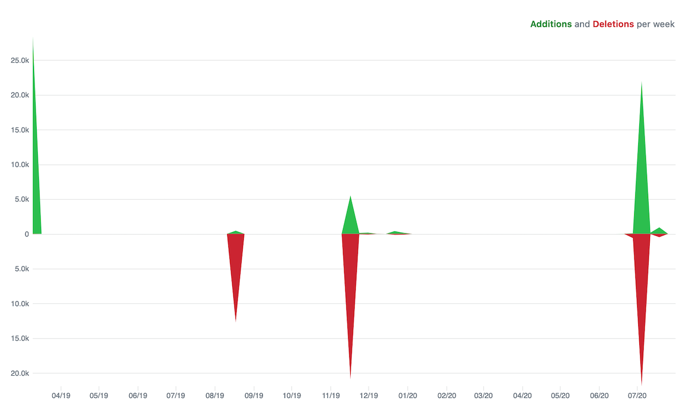

I only had two hard requirements when I started this site up. At work we have an internal development blog that uses a static site generator. The articles are markdown files that you check into the repository and the CI/CD system builds the site and deploys it. That workflow is very familiar to developers, and was an appealing workflow for here. I also wanted to use some newer frameworks, specifically front-end heavy ones, that I was not real familiar with so that I could learn as I was building.

The first thing I did was went out and found the _agingdeveloper.com_ domain and registered it at [bluehost](https://www.bluehost.com/) along with a hosting plan. This was the service provider I had previously used. That became my first **false start**. I should have waited to figure out hosting until after I had the framework and deploy pipeline figured out.

I next set up a [repo](https://github.com/richwklein/agingdeveloper) and went about trying to figure out which frameworks I wanted to use. I've used [Pelican](https://docs.getpelican.com/en/stable/index.html) before, but that wasn't what I was looking for since it is written in Python and not really a new framework for me. I enlisted the help of [StaticGen](https://www.staticgen.com/), a great resource that compares various static site generators. It helped me narrow my choices. My second **false start** came when I started out with [Eleventy](https://www.11ty.dev/). I actually had a branch building with it. In the end the templating felt too similar to what I had used in the past.

I finally landed on **[Gatsby](http://gatsbyjs.org/)** a Javascript framework that uses [React](https://reactjs.org/) for templating and is powered by [GraphQL](https://graphql.org/). I wanted to learn more about both React and GraphQL so it was a perfect fit for me to use.

I had my hosting and my framework now I just had to find my deploy pipeline. This is where that first **false start** comes into play. The only way I could deploy my site to bluehost was via FTP. I tried to get this working with
[Travis CI](https://travis-ci.org/) for a while, but I never really got it working and it just didn't feel right. I then went out looking for either a new CI/CD system or a new host. I landed with [Netlify](https://www.netlify.com/) which is built for a "git based developer workflow" (exactly what I wanted) and includes CI/CD, DNS & Domain management, and hosting.

I first started putting things together by coding all my own React components from scratch. That was my last **false start**. I realized it was silly to be reinventing the wheel when there are lots of component libraries out there.
Just because I was using a component library did not mean I wouldn't be learn React as I went along. I settled on using [material-ui](https://material-ui.com/) as my component library.

There are some other interesting bits that make this site tick and are worth mentioning. I'm using [Let's Encrypt](https://letsencrypt.org/) to get a _free_ SSL cert. Almost of the images I'm using on here are from [Unsplash](https://unsplash.com/) which provides _free_ to use photos for anyone.

In my [previous post](/article/2020/07/21/intro) I mentioned that it was about a year ago that I started to want to re-engage in the online community. It didn't take a year to go from the idea germinating until it was something that
was visible to share. I am a passionate developer, but I went for long stretches without putting any effort toward this as you can tell by the code frequency graph.

It took me a few false starts and some long stretches of down time, but I've landed on a workflow and a tech stack that I think will suite this "Aging Developer".
