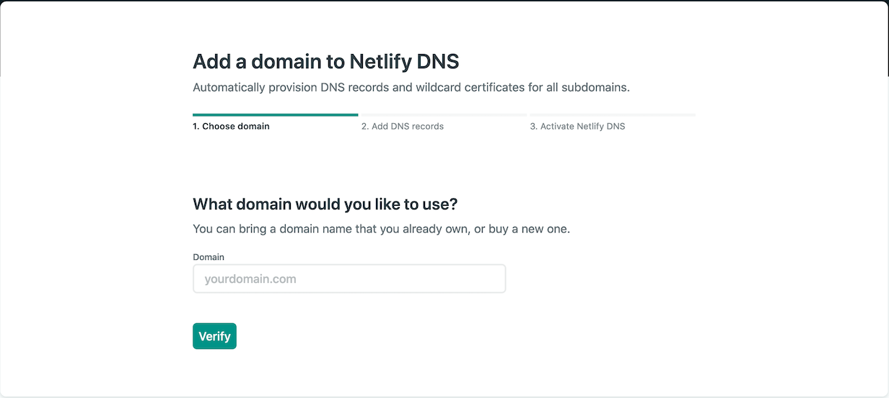
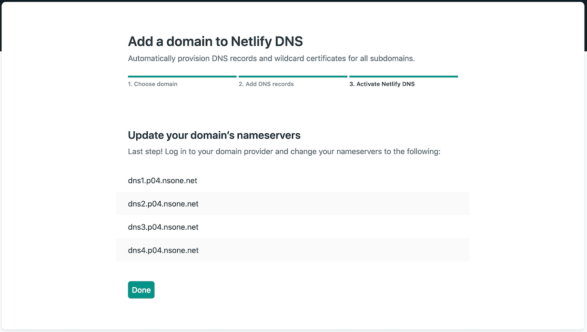
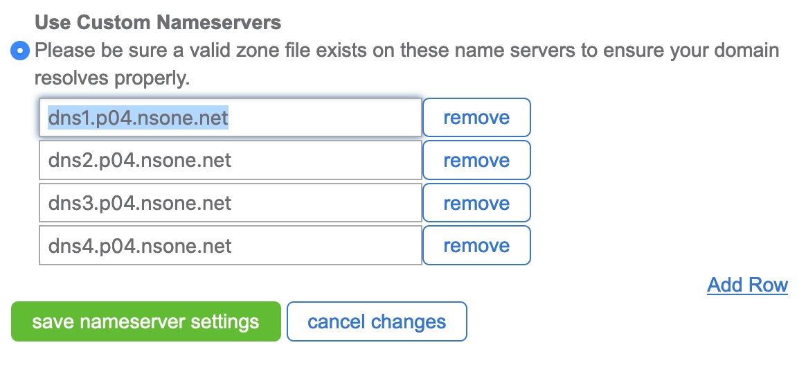

[Netlify](https://www.netlify.com) is a great service. It gets my workflow and I can't heap enough praise on it. It provides a subdomain for your site to be hosted on by default. This is great way to get started. At some point though your going to want to move your site off to it's own domain. Making that change is not particularly hard, and Netlify has [great documentation](https://docs.netlify.com/domains-https/custom-domains/configure-external-dns/#configure-a-subdomain), but for those of us that have not worked much with DNS it can be intimidating. So this article will walk through an example of how
to set this up.

In this example I'm going to assume you already have a domain registered. I went and registered [agingdeveloper.net](https://agingdeveloper.net) as part of this exercise just to remind myself how to do it. My [False Starts Article](/article/2020-07-26-false-start) explained how I had previously set up hosting and registered the domain agingdeveloper.com with
[BlueHost](https://www.bluehost.com). That is the registrar I'm going to be using here. You may have to do something different with other registrars. The screenshots are from setting up a second domain, They will look different then when setting up your first domain.

In Netlify go to your site's Settings › Domain management. Select _Add custom domain_ at the bottom of the **Custom domains** panel, enter your domain name, and select _Verify_.

Confirm you are the owner of the domain then select _Yes, add domain_. We are going to choose to delegate the domain Netlify. Make a copy of Netlify's nameservers. These are listed directly below the custom domain panel.

On your Bluehost's domain page, select the domain that you want to delegate. Then select the _name servers_ tab. Choose the option to _Use Custom Nameservers_ and input the previously copied list.

Select _save nameserver settings_. It may take just a minute for the setting to take effect, but that is all you have to do. Your site should now show up at the new domain name. Pretty easy, right!!!
