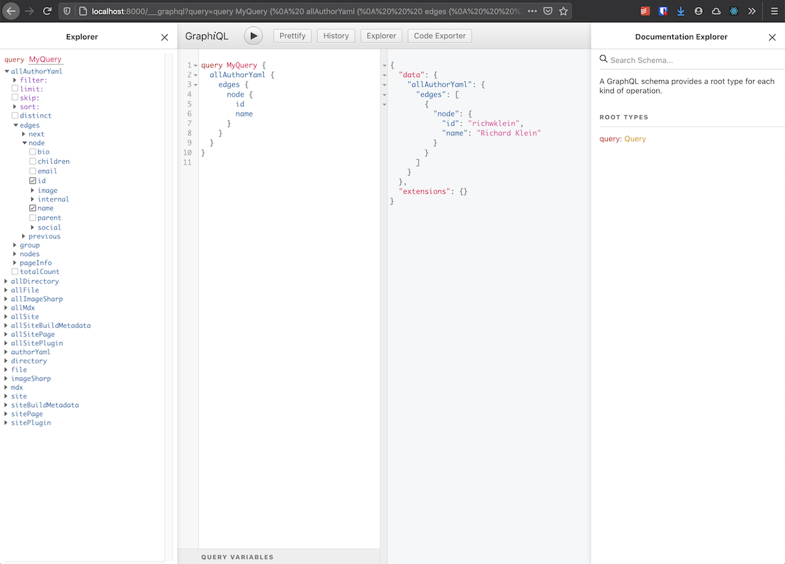
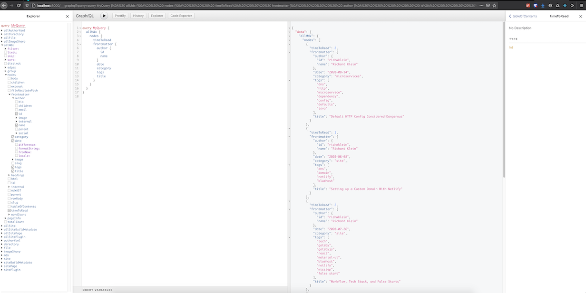

I've previously [mentioned](/article/2020-07-21-intro) that this site was created for me to interact with the public again as well as to learn some new technical skills. That doesn't mean that "The Aging Developer" has to be a one man show. I do not have to be the only person to contribute to it. Both the code and the content of the site are both hosted in a public [github](https://github.com/richwklein/agingdeveloper) repo.

If you've previously been on the site you may have noticed that there was stubbed in navigation for an "Authors" page. This weekend I've finally been able to implemented support for multiple authors.

This article will explain how you can contribute content if you want and also how I went about building support for multiple authors.

## Contributing Content

If you feel like you have some content that relates to the theme of the site you can create and submit a pull request for me to review and accept or reject.

If this is your first time contributing there are two things you'll need to supply. The article itself, including any images, and an author file.

The article goes in the **_/content/article_** directory. There is not a required layout for that directory, but I've been creating a subfolder with the slug of the article as the name. The folder contains both the article as well as any images in the article. This makes it easier to get the links between working correctly. The articles are written in mdx (Markdown + JSX) and should include a section of front matter at the top of the file. The code block below shows the front matter for this article.

```yaml
---
slug: 2020-08-22-guest-authors
title: Support for Guest Authors
author: richwklein
image: aaron-burden-y02jEX_B0O0-unsplash.jpg
tags:
  - gatsbyjs
  - material-ui
  - public
  - react
  - code
  - author
  - support
  - yaml
category: site
published: '2020-08-22'
---
```

The value of the author key in the front matter gets mapped to the id of an author node in Gatsby's graph during the build process. The author nodes are provided by creating an yaml file in the **_/content/author_** directory. That file contains information about the author including: email address, name, a short biography, avatar image, and social media links. Below is a sample of my [file](https://github.com/richwklein/agingdeveloper/blob/master/content/author/richwklein.yaml).

```yaml
id: richwklein
name: Richard Klein
---
social:
  twitter: https://twitter.com/richwklein
  facebook: https://www.facebook.com/richwklein
  linkedIn: https://www.linkedin.com/in/richwklein/
  github: https://github.com/richwklein
  instagram: https://www.instagram.com/richwklein/
```

## How it was implemented

Now on to how I implemented support for authors on the site. [Gatsby](https://www.gatsbyjs.com/) has a few tutorials around how to implement this, but I found some of the tutorials on doing the linking between article and author nodes overly difficult to implement. Hopefully, this example can help others who might be trying to accomplish the same thing without the struggles I originally had.

In my **_gatsby-config.js_** file I have my file source set up to point at the **_/content_** directory. This allows just a single source plugin to supply both the article and author data. If you want to serve author information out of a different directory than the article information, you can set up a copy of the file source plugin with a path set to a different directory.

```jsx
plugins: [
  {
    resolve: "gatsby-source-filesystem",
    options: {
    path: `${__dirname}/content`,
  },
]
```

There are a few file formats you could choose to supply the author information from. I've seen examples including json and markdown. I decided that I wanted to supply author data via YAML.

To accomplish this I first had to install and configure a transformer. A transformer is a type of Gatsby plugin that takes raw content from a source plugin and transforms it into something more useful. I used the `gatsby-transformer-yaml`
plugin to transform the author file content into a node in the graph with the appropriate attributes from the YAML data.

```shell
npm install --save gatsby-transformer-yaml
```

```jsx
plugins: [
  "gatsby-transformer-yaml",
  {
    resolve: "gatsby-source-filesystem",
    options: {
    path: `${__dirname}/content`,
  },
]
```

After creating my YAML file, **_/content/author/richwklein.yaml_**, and starting a local development server, the content was available by looking at the graphql ide in the browser.



Once I had the author information in the graph, I needed to provide a way to link that information with the articles that the author wrote. I did this by adding an "author" key to the front matter of the article files. The key contains the id of the author to link back to. I then added a "mapping" configuration to the **_gatsby-config.js_** file.

```jsx
mapping: {
  "Mdx.frontmatter.author": "AuthorYaml",
},
```

The full information of the author could then be queried as part of the front matter of the individual articles.



It was pretty straight forward to create a byline section on the article pages as well as the various author related pages once the configuration was done.

The byline contains the author's avatar, a link to the author's page, along with the date the article was published and how long it should take you to read the article.

The [Authors](https://agingdeveloper.com/author) page contains a grid of all the authors that have contributed to the site with an avatar button to each author's individual page.

The author's individual page has their name, bio, social links, and articles they have written. the page is built from a template via **_gatsby-node.js_**. This is done by including the author in the graphql query that runs as part of the build. It outputs a page for each node in the author section of the graph.

```jsx
exports.createPages = async ({ actions, graphql, reporter }) => {
  const { createPage } = actions

  const result = await graphql(`
    ...
    authors: allAuthorYaml(sort: { fields: name, order: DESC }) {
      edges {
        node {
          id
        }
      }
    }
`)

  createAuthorPages(createPage, result.data.authors.edges)
}

const createAuthorPages = (createPage, authors) => {
  const template = path.resolve('src/templates/author.js')
  const prefix = '/author'

  authors.map(({ node }, index) => {
    const currentPath = node.id

    return createPage({
      path: `${prefix}/${currentPath}`,
      component: template,
      context: {
        currentPath: currentPath,
      },
    })
  })
}
```

Once I figured out how to get the mappings working between the article front matter and the author's information, it was not difficult to implement the rest.

It is still probably the biggest change I've made to the site since launching it. So if you find any issues please submit a [github issue](https://github.com/richwklein/agingdeveloper/issues).

Also, if you like what I'm doing and would like me to continue try getting a hold of me using one of the social links on my [author page](https://agingdeveloper.com/author/richwklein).

**Remember if you would like to contribute feel free to open a pull request.**
