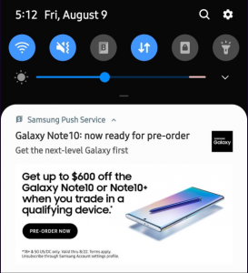
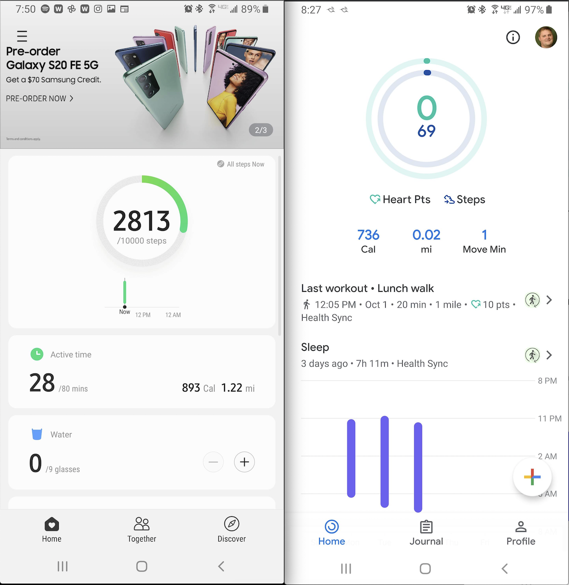
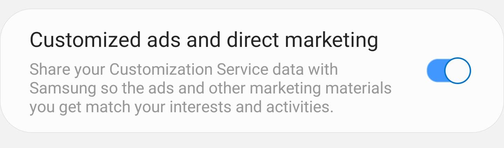
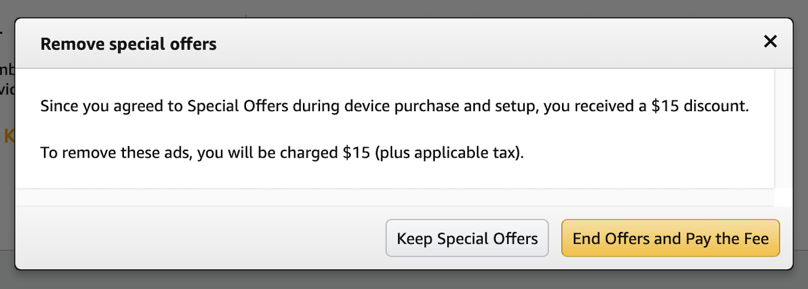

We are a fairly vendor agnostic family. We own devices from Amazon, Google, Apple, Samsung and others.

I have a Samsung S8+ phone and a Samsung Gear Fit watch. About a year ago I started to look for a replacement for my Gear Fit because I wanted something a little bit newer with some more features. I was originally sticking with Android Watch OS and Samsung Tizen based devices for my initial search. However, Samsung's advertising practices pushed me over to Apple products.

I've own Samsung phones and tablets for close to 10 years. I've always felt that they were well built. The design and functionality of the products were great. It has only been in the last few years that the advertisements have 
become so pervasive throughout the user experience that it is now a problem.

Advertisements show up as push notifications whenever they want you to buy one of their new products.

All of the default apps now devote some real estate to advertising. A full third of the above the fold screen is devoted to ads in the Health app compared to no advertising in Google's Fit app.

There is no way to turn these ads off. There are options that looks like it might allow you to. They don't though. You can only opt out of ad customization.

I would expect free or low cost goods or services to be subsidized through advertising. That includes devices. These ads are on a phone that I paid over $1,200 for. This is not to offset the cost of the device in any way shape or
form.

These ads have finally pushed me over the edge and forced my to re-evaluate who we buy all our devices from.

## Why Apple?

Apple is not without flaws. I think some of their app store practices are down right monopolistic or at the very least anti-competitive. So why switch to Apple products instead of sticking with something Android based. 

I was spurred on to make this decision largely because I wanted to replace my aging Samsung Gear Fit. Looking at the fitness trackers and watches on the market today, the only serious replacement is the [Apple Watch](https://www.apple.com/watch/).

Apple charges a premium price for their products and services; in exchange they take a harder stance on [privacy](https://www.apple.com/privacy/). Evidenced by their recent changes to limit how other companies can access your data. This gives me some level of comfort that they will not be selling my data or placing intrusive ads anytime soon.

## How does Amazon get a pass?

We have some Amazon devices (mainly tablets and Echos) that we will not be getting rid of any time soon. Amazon advertises on the devices that they make. Why take a stand against Samsung yet give Amazon a pass?

* The Amazon [Fire 7](https://smile.amazon.com/dp/B07FKR6KXF?ref=MarsFS_TAB_F7) tablets starts out at $50 and regularly is on sale for less. 
* It states clearly on the product page that the price point is with ads.  
* The ads are just on the lock screen and not very intrusive. 
* If you do not want the ads, you can pay an extra $15 to opt out of their "Special Offers".

## Making a change

Others are taking [notice](https://www.androidpolice.com/2020/07/04/ads-are-taking-over-samsungs-galaxy-smartphones-and-im-fed-up/) of the way Samsung is treating it's customers and are not happy about it either. Their [TV](https://www.flatpanelshd.com/news.php?subaction=showfull&id=1583755244) 
customers are being treated in much the same way.

They even [boast](https://www.samsung.com/us/business/samsungads/) about their advertising platform on a site used to attract advertisers. 

Privacy has always been important; especially so in this digital age. It is becoming increasing clear that some companies have no qualms about invading that privacy just to get a few eyeballs on their ads and try to make some sales. 

I'm taking a stand against this with my wallet by taking my business somewhere else. Losing a single families business will probably not break Samsung, but if more people do the same maybe they will take notice and it will drive some change.
