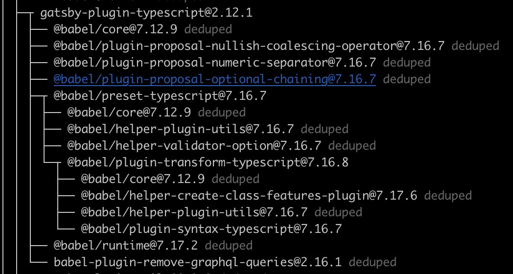

A large portion of software today follows some form of [SemVer](https://semver.org/) or _Semantic Versioning_ when it comes to how that software is versioned. When software follows _Semantic Versioning_ then the string used to identify the software's version has meaning. The version is made up of at least three parts separated by periods (`<MAJOR>`.`<MINOR>`.`<PATCH>`). There are specific rules about when each part of the version string should be updated.

1. **MAJOR** version when you make incompatible API changes,
1. **MINOR** version when you add functionality in a backwards compatible manner, and
1. **PATCH** version when you make backwards compatible bug fixes.

These rules allow people to reason about the kinds of changes that occurred between one release and the next one. A **MAJOR** version change implies some sort of breaking change. Breaking changes are disruptive and should be considered "harmful".

## Harmful Major Release

[Gatsby](https://www.gatsbyjs.com/) is the underlying framework used to power this site. It and all it's dependencies follow this _SemVer_ pattern. There has been a fair amount of time, as you can tell, that has elapsed since the last time the site has been updated. _Gatsby_ had put out a major release going from **2.x** to **3.x** (It is above **4.0.0** now). These releases have had backward incompatible changes.

I've spent some time trying to move up to a more recent major version. The changes are disruptive enough that it has taken me more time and energy than I was willing or able to spend to make the upgrade. I am still planning on keeping this site going and up to date, but at this point I think the easiest path is to going to be to rebuild from scratch. I haven't decided yet if I'll stick with Gatsby or try something else at this point.

This situation is not unique. I've seen it countless times in my software development career. A major release of a dependency causes such problems for it's consumers that the consumers either have to spend a large amount of time forward fixing or they may find it easier to just replace the dependency with something else.

## Mitigation Techniques

A major release does not have to be painful. There are some strategies by both the dependency producer and consumer that can help mitigate these kinds of problems.

### Dependency Producer

As the producer of APIs or libraries that others rely on, you have an obligation to make updating that dependency as easy as possible.

- When making a breaking change then take a long time to consider the reason why. Any breaking change causes significant disruption to downstream developers and should be avoided when possible. There are some legitimate reasons why you must have a breaking change, for example mitigating a security issue.

- Avoid "Big Bang" releases. A “Big Bang” release is when many different features, bug fixes, improvements, or any type of changes go out in the same release. These types of releases almost always cause problems. Consider limiting the number of breaking changes allowed for any single major release.

- Limit how often you cut a major release. You do not want to include too many breaking change in any one major release. You also do not want to have major releases too often. Every major release requires some level of effort on your consumers. The more burden you put on them to keep up to date the less likely they are to continue using your software.

- A companion strategy may be to provide a "Long Term Support" (_LTS_) release. These are major releases that will continue to get security and maintenance for a long period of time. The LTS versions are considered to be the most stable releases which undergoes extensive testing and mostly includes years of improvements along the way. This gives your consumers confidence to use your software without having to worry about keeping up with every new feature release you put out there.

- Gradually replace or remove APIs. Introduce a new API to be used as a replacement in one release, marking the old API as deprecated, then remove the deprecated API in a future later release. Deprecation should include meaningful warnings about the usage of the deprecated API, what replaces it, and when you need to stop using it by. This gives consumers some time to make the switch over without introducing an instant failure.

- Provide clear and easy to find documentation (outside of the runtime) around a breaking change being made. You should include details like: Why is the change being made, instructions on how to update usage, and timelines as to when usage must be updated by.

- Try not to introduce breaking changes accidentally. I've seen in both major and minor versions where a change was introduced that was breaking, but not marked as such. When and what type of exception being thrown is part of an API's contract and is a common cause of these kinds of accidental breakage.

### Dependency Consumer

As a consumer of a library, framework, or API; you have less control in mitigating breaking changes. There are still a few things that can be done to lessen these issues.

- Know your direct and transitive dependencies. Every project and package ecosystem is a little bit different. It is best to at least have some basic knowledge of what your dependencies are. As well as what the release schedule tends to look like for those dependencies. Every package manager has some way to view your dependency tree. _npm_ has the _list_ command where the depth argument lets you specify how deep down the dependency tree to go.

```bash
npm list --depth=4
```



- Automate dependency updates. There are automatic tools to help keep your dependencies up to date. One example of this is [Dependabot](https://docs.github.com/en/code-security/supply-chain-security/keeping-your-dependencies-updated-automatically/about-dependabot-version-updates) on github. You can specify on a per repo basis what package manager is being used, number of open pull requests allowed, the update frequency, and more. This will automatically create pull requests when a new version of a dependency is release. It does not help resolve any breaking changes that may be in the release.

- If your dependency provides an _LTS_ release and you are mildly averse to having to keep up with someone elses release schedule then pin to that _LTS_ release. This will allow you to have a much more controlled updated schedule. You usually only see these supported for Operating Systems and programming languages, but those are dependencies too.

- Read the documentation. Regardless of how your projects dependencies are kept up to date there will be times where you will need to fix breaking changes. If the dependencies is a major one then they may provide an upgrade guide similar to this [Gatsby v2 to v3](https://www.gatsbyjs.com/docs/reference/release-notes/migrating-from-v2-to-v3/) guide. When a migration guide isn't provided then you will likely have to read through a changelog or individual commits.

## Real World

Your major version strategy may be great, but there are always complications in the real world. Here are just a few examples:

python 3.x was largely incompatible with 2.x, especially in the handling of strings. Python 3 was first released in 2008 and the 2.x line of Python was deprecated with 2.7 being the _LTS_ release in 2010. December of 2020 was the end of life for the Python 2.x release line. That is 10 years of long term support and companies are still spending millions of man hours making there codebases 3.x compatible. One could argue 10 years is too long even for an _LTS_ release.

The popular Java logging library _log4j_ had a remote code execution vulnerability discovered in December of last year. The vulnerability related to the handling of LDAP and JNDI urls. One of the maintainers [tweeted](https://twitter.com/yazicivo/status/1469349956880408583?s=21)

> Log4j maintainers have been working sleeplessly on mitigation measures; fixes, docs, CVE, replies to inquiries, etc. Yet nothing is stopping people to bash us, for work we aren't paid for, for a feature we all dislike yet needed to keep due to backward compatibility concerns.

The key takeaway from that tweet being the second sentence. It is not worth keeping a bad feature or API just for the sake of "backward compatibility".

## Conclusion

Major releases are always some form of disruption and can be considered harmful. Everyone should seriously weigh the need for a new major release against the effort required by the downstream developers.
