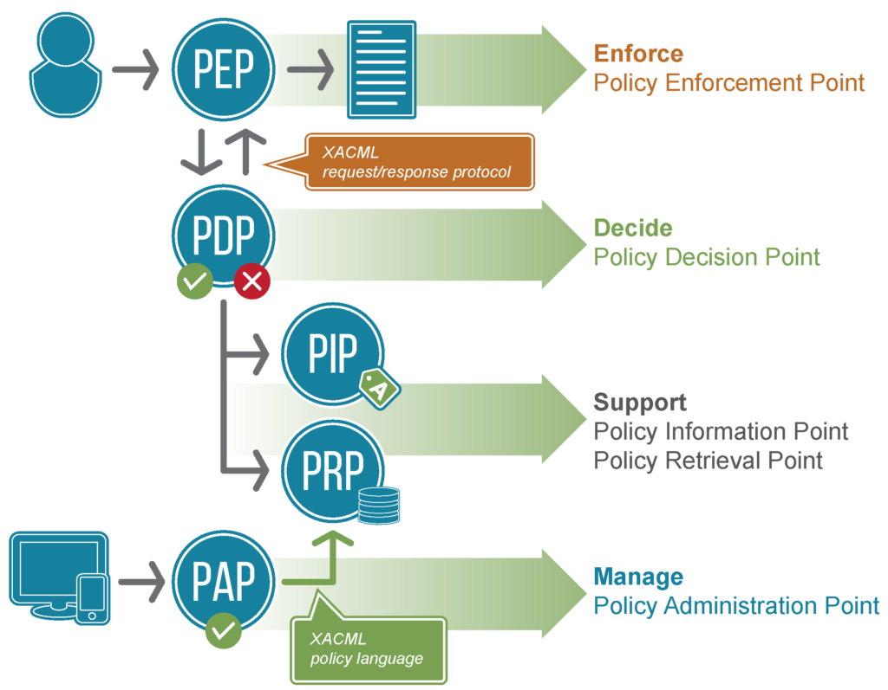

Authorization, the granting or denying of access to a resource, is something that almost all software has to do. Yet, developers tend not to give it a lot of attention. It is a difficult problem to solve in large distributed systems. In distributed or microservice environments you are more likely to run into communication and coordination issues dealing with multiple teams, repositories, and release schedules. Those individual services are also much more sensitive to having dependencies on other services and the performance implications that may have.

I have spent large portions of my career on authorization related development and it is something that I can put a spotlight on here. This article explores some of the basics of authorization, what it means, and a few ways to do authorization in microservice environments. Subsequent articles will follow-up with some more concrete examples using different libraries and frameworks.

## Authentication is not Authorization

**Authorization**, abbreviated as Authz, is the act of granting or denying access to a resource. This is often confused with **Authentication** (Authn) which is the process of confirming the identity of a user or service. These two &quot;Auths&quot; are often intertwined and get easily confused with one another. Frequently, the first step in authorizing a request is making sure that it originates from someone who has been authenticated. However, just being authenticated is often not enough to prove that you are authorized. The Authn and Authz systems can be highly coupled or can be completely separate from one another.

This article will not really go into the mechanics of authentication. Authentication is not as implementation dependent as authorization and there are lots of off the shelf solutions for authentication that can be integrated fairly easily.

## Common Access Control Models

An access control model is the method used in authorization systems to determine who or what should be granted or denied access to a resource. When talking about the "who or what", I will refer to them as a _principal_. Regardless of the system that is being used for authorization one of these five &quot;Access Control&quot; models will likely be used. I have the most experience with discretionary and role based access control and those will be used as examples in the follow-up articles.

### Mandatory Access Control

<abbr title="Mandatory Access Control">MAC</abbr> is a static access control method. Resources are
classified using labels or levels. Users are also classified with the same labels. A user can access
a resource if they have the same or greater label. When you hear someone has been granted &quot;Top
Secret&quot; clearance that is an example of a MAC implementation.

### Discretionary Access Control

When using the <abbr title="Discretinary Access Control">DAC</abbr> method the **owner** of the resource decides who can access it. An <abbr title="Access Control List">ACL</abbr> controls who has access to the resource and the data owner sets the permissions. The permissions identify what actions the principal can perform on the resource. The file system is a classic example of a DAC. The permissions in that case are "read", "write", and "execute".

### Role Based Access Control

When using <abbr title="Role Based Access Control">RBAC</abbr> access is determined based on the role a principal is given. The role may be a job position, group membership, or security level. The role is granted or denied access to the resource.

### Rule-Based Access Control

<abbr title="Rule based access control">RB-AC</abbr> is based on rules to deny or allow access to
resources. This is typically seen most often in thing like network devices where ACLs determine
which IPs or port numbers are allowed through, and this is done using rules.

### Attribute-Based Access Control (ABAC) Model

<abbr title="Attribute Based Access Control">ABAC</abbr> allows or denies access based on
attributes. These can be the attributes of a particular person, of a resource, or of an environment.
Attributes may be the Subject (height of a person in an amusement park), Resource (software that
only runs on a particular operating system or website), or Environmental (time of day or length of
activity time passed).

## The Parts of an Authorization System

I've spent a lot of time thinking about and working with authorization systems, but it wasn't until the last few years that I internalized the parts involved in authorization. Regardless of the system being used or if you have a single or multiple services, these parts make up an authorization system. When deciding on an authorization system these parts should be kept in mind.

<dl>
  <dt>Enforcement Point</dt>
  <dd>
    The <em>Enforcement Point</em> is the spot in your software where you are going to enforce an
    authorization decision. In a client server application there would likely be two enforcement
    points. In the client when deciding to show or hide elements based on an authorization decision.
    For example disabling a create button if a user doesn't have permission to create an object. The
    other point would be on the server, usually at the control or service layer. You must always
    double check authorization at the service layer as someone could simply craft the request
    without actually using the UI elements.
  </dd>
  <dt>Decision Point</dt>
  <dd>
    The <em>Decision Point</em> is the spot where the decision is made to grant access to a
    resource. This may be the same place as enforcement or it could be somewhere completely
    different. The decision point is responsible for gathering all the information required to make
    an authorization decision, making that decision, and returning the results to the enforcement
    point so that the decision can be enforced.
  </dd>
  <dt>Information Point</dt>
  <dd>
    The <em>Information Point</em> is where all the information that is needed to make an
    authorization decision are gathered. It can be co-located with other points in the authorization
    process or it can be separate. In a MAC control system the information needed would be the
    access level of the resource being accessed and the level of the principal doing the action.
  </dd>
  <dt>Administration Point</dt>
  <dd>
    The <em>Administration Point</em> is the place where the policies for an access control method
    are authored and/or managed. This may also be the point where the information to make a decision
    is managed.
  </dd>
</dl>

These terms were popularized by the <abbr title="eXtensible Access Control Markup Language">XACML</abbr> standard that was first ratified in 2003 and last updated in 2017. Below is a diagram from [axiomatic](https://www.axiomatics.com/100-pure-xacml/) showing off these parts.

If any of the above authorization points is not co-located it is important that the communication between them is secured. It is also critical that if the communication fails between the points that the enforcement fails in the way that is most important to your application. In a lot of applications this would mean to _deny_ access by default.

## Authorization System Patterns

When doing authorization in microservices there are a few approaches that emerge. It's worth spending a little bit of time on each approach since they have various pros and cons. It also allows us to examine where each part of the authorization system is implemented.

### Local Authorization

In the local authorization pattern the individual resource services are responsible for developing their own authentication and authorization of a principal. The resource service is responsible for making all it's authorization decisions.

#### Pros:

- Each service can implement the authorization mechanisms best suited for that service.
- There is no communication overhead or dependency on other services.

#### Cons:

- It's hard to understand why a principal has access to one resource and not another.
- Each team needs to know and understand the access controls for the system.
- Changing the access control system globally becomes extremely difficult.

### Centralized Authorization

In the centralized authorization pattern then the resource services hands off all responsibility for authentication and authorization to a centralized service. The access control decision is made at the centralized service and returned.

#### Pros

- There is less duplicate code.
- It's easier to determine why a principal was given access to a resource.
- It's easier to make global changes to those mechanisms.

#### Cons

- There is an extra network request involved in accessing a resource.
- Resource services are dependent on another service.

### Local Decision / Centralized Policy

This is a hybrid approach that combines the strengths of the previous two patterns. In this pattern the decision to allow access to a resource is made at the resource service, yet the access control mechanisms are defined and maintained at a central service.

#### Pros

- There is no network request when making decisions.
- There is less duplicate code.
- It's easier to determine why a principal was given access to a resource.
- It's easier to make global changes to those mechanisms.

#### Cons

- All information for authorization needs to be present at the resource service.

**Local Decision / Centralized Policy** systems have been a growing trend in recent years. These types of authorization systems have a meta-model that is used to describe what access control mechanisms are in use by your resource services (policies). Information can then be applied against the meta-model to make an authorization decision.

I believe these policy systems will be the most common pattern for doing authorization in microservices moving forward.

## Follow Up

In my next article in this series I am going to explore what it looks like to do authorization using some policy based authorization systems: [Casbin](https://casbin.org/) and [Open Policy Agent](https://www.openpolicyagent.org/).

I'll demonstrate what it looks like to model some of the various forms of access control and how you might gather the information that needs to be supplied to the authz system so that it can produce an access control decision.
