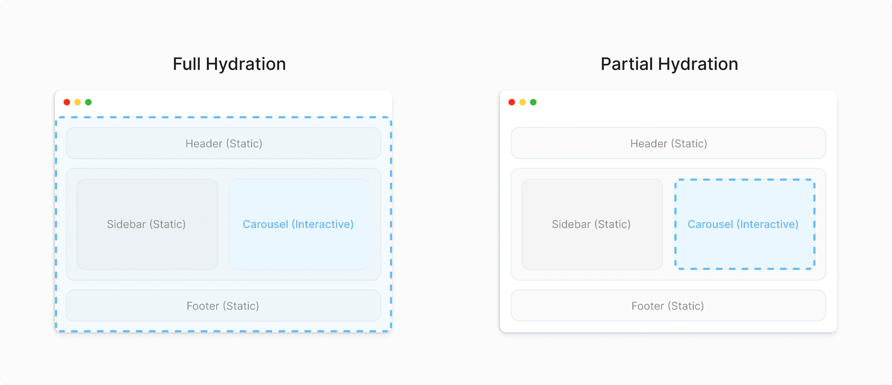

I've previously wrote that [major versions should be considered harmful](/article/2022-02-26-major-harmful). I haven't done anything with this site in a long time partially because of that. Another reason is I wanted something where I could run a small amount of code on the front-end, but I wanted the majority of the site to be served statically. I do not mean pre-generating large amounts of javascript that then hydrates and renders the page client side. I wanted to generate actual html that is returned by the server and only have small amount of JavaScript for interactions. That has lead me to look at various other static site generators like **[astro](https://astro.build/)** and **[11ty](https://www.11ty.dev/)**. Astro's island architecture looked promising, but it was yet another framework and language to learn.

**[Gatsby](https://www.gatsbyjs.com/)** continues to be a set of technologies that are interesting to me and it was announced there is a new feature called _Partial Hydration_. Since partial hydration seemed like it may fulfill what I was looking for, I rebuilt the site with the most recent version of Gatsby.

This article chronicles my experience in going from the existing `Gatsby 2.*` based site to a `Gatsby 5.*` site. I used the original code as guidance, but it is a few years old so I have mainly rebuilt from scratch.

## Timeline

I started this endeavor on October 7th, 2023. My hope was to work on this on the weekends when I had time available. Silly me thought I could relaunch fairly quickly but, I have had to scramble to get it out the door prior to the new year.

## Partial Hydration

Hydration or re-hydration is the process of using client-side JavaScript to add application state and interactivity to server-rendered HTML. Gatsby apps were always fully hydrated on the client. Gatsby 5 added support for partial hydration. Gatsby uses [React server components](https://github.com/reactjs/rfcs/blob/main/text/0188-server-components.md) as the backbone of it's partial hydration implementation. It marks all components as server components starting from the top level pages. Unless specified with the “use client” directive. Gatsby generates RSC files for each page. Instead of fetching page component JavaScript files in the browser now, page-data-rsc.json files are requested. See [this article](https://www.gatsbyjs.com/docs/conceptual/partial-hydration/) for the details.



After doing some more reading the partial hydration feature there were some caveats that I had to evaluate. It required using an experimental version of _react_ and _react-dom_. It may not work well with some other new features that improve performance like [Slices](https://www.gatsbyjs.com/docs/reference/release-notes/v5.0/#slice-api). It also didn't really seem like what I was looking. I continued the rebuild anyway and hoped there were no show stoppers.

## Testing

The first time creating this site, I didn't bother creating unit tests. It was a personal project being built in my spare time. It didn't feel worthwhile to create them. This time around, I've started adding unit tests for at least the components. Each component has a [snapshot test](https://jestjs.io/docs/snapshot-testing) and additional tests for branching logic. These will give me some assurance that dependency version bumps have automated testing on them.

Part of the hesitancy with creating tests before was around all the scaffolding needed to stand up basic unit tests. That is still a complaint. I needed to install 7 dev packages, 4 configuration files, and two mock files just to get some very basic testing going. Along with the [Gatsby documentation](https://www.gatsbyjs.com/docs/how-to/testing/unit-testing/) The following articles were a huge help in setting these up.

- [Get started with Gatsby and Unit Testing](https://danielabaron.me/blog/gatsby-unit-testing/)
- [How to Test React Components: the Complete Guide](https://www.freecodecamp.org/news/testing-react-hooks/)

## Stumbling Blocks

I hit a few stumbling blocks along the way which made / makes development more difficult than it needed to be. I couldn't get the site to build locally with those experimental react components so the rebuild was done using the long term releases instead which meant _no partial hydration_.

```shell
Module not found: Error: Can't resolve '@mdx-js/react'
```

### Material UI Upgrade

Doing this upgrade I went up a major version of [Material UI](https://mui.com/material-ui/getting-started/). Between the versions the import paths all changed. The paths went from "@material-ui" to "@mui/material/". Another big change to deal with was going from JSS to [Emotion](https://emotion.sh/docs/introduction) for the default styling. This meant a whole new syntax when wanting to override the theme.

I had to switch from doing something like:

```jsx
const useStyles = makeStyles((theme) => ({
  cardContent: {
    margin: 0,
    paddingTop: theme.spacing(1),
  },
});

const classes = useStyles();
<CardContent className={classes.cardContent}>
```

to the [sx syntax](https://mui.com/material-ui/customization/theme-components/#the-sx-syntax-experimental):

```jsx
<CardContent component="p"
  sx={{
    m: 0,
    pt: 1,
    "&:last-child": {
      pb: 1.5,
    },
  }}>
```

### Common JS vs ES Modules

I started out with the react components for this build using the ES modules syntax for imports and exports. I also started to switch over Gatsby files to that format as well. The eslint configuration is setup using the module syntax. I then started to run into some import problems with the slugify library in my unit tests. This lead me down a rabbit hole where I learned Jest only has experimental support for ES Modules and Gatsby also only has partial support. If I specify "module" as the type in my _package.json_ then the `gatsby develop` command starts failing trying to load a file from cache without an extension on it.

I ended up sticking with using the ES Module syntax where possible. I have the type set in package.json to commonjs, to act as the default syntax, but I used the ES Module syntax in `.mjs` files for Gatsby and in the `.jsx` files for React.

### NPM Segfault

While working, I usually run `gatsby develop` from the command line to view updates to the site in real time. When I need to stop the process, I use _Ctrl+C_ to send a **SIGINT**. Whenever I try to run either the build or develop commands after that I get a segfault exception. At first I would quit the terminal and restart it, which took a long time. Eventually, I figured out I could run `gatsby clean` in between and it would avoid the failure. Because of this, I now run the below command every time.

```shell
npm run clean && npm run develop
```

## The Results

There were a few stumbling blocks that slowed development, but I feel like the code is to the stage where I can replace the current deploy. I've made a fair amount of improvements to the site and code health along the way. I've also removed some features. Some of those trims are likely to be permanent where others are only going to be temporary.

### Improvements

The front page of the site has been tweaked to have a new hero image component on the top, and then a grid of horizontal article cards below it. This replaces the vertical cards with badging on the new articles. The badge was some of the client-side interactions that I thought would be used with partial hydration. Instead this new layout freshens up the site a little bit.

The article pages have the author byline and time to read moved around with some space added for a related articles feature that I'm planning in the future. The hero / featured image on the article has been wrapped in a `<figure>` tag with credits for the image now in a `<figcaption>`.

I have added JSDoc strings to all the react components. Those can be generated via `npm run docs`. I am going to continue to make improvements to that documentation and look to see if I can use something like a github action to automatically generate new documentation when merging pull requests into master.

Almost all the components now have [prop-type](https://www.npmjs.com/package/prop-types) validation. There are a few tests that break the validation, but the deployed site has all console errors taken care of. I had to comment out some lint rules and not provide prop-types for the `Head` hook that Gatsby provides as that caused problems during the build.

I previously had support for [guest authors](/article/2020-08-22-guest-authors). When I was first looking to rebuild I thought that might be a feature that hit the cutting room floor. The mappings in the _gatsby-config_ file was not very robust and honestly no one else is going to publish to this thing. However, getting author support re-added was pretty easy, and I like the way I did it. Instead of an **author** subdirectory in the data folder, I have a single **author.yaml** file now. The file contains a list of author nodes. I then added some schema customization to the _gatsby-node_ file that maps the author in the mdx frontmatter to the AuthorYaml node via a "slug" property in the yaml.

```jsx
export const createSchemaCustomization = ({ actions, schema }) => {
  const { createTypes } = actions
  const typeDefs = [
    'type Mdx implements Node { frontmatter: Frontmatter }',
    schema.buildObjectType({
      name: 'Frontmatter',
      fields: {
        author: {
          type: 'AuthorYaml',
          resolve: (source, args, context, info) => {
            return context.nodeModel.findOne({
              type: 'AuthorYaml',
              query: {
                filter: { slug: { eq: source.author } },
              },
            })
          },
        },
      },
    }),
  ]
  createTypes(typeDefs)
}
```

Before the rebuild all links in the mdx content files were rendered as regular anchors tags. I was able to replace those anchors with a new `MDXLink` component. This component tests the href. If the href is a relative url then the internal Gatsby link component is used. If the url starts out with the same host as the site then the href is converted to a relative link. Otherwise, an external link is used. This is done by using the components property of the `MDXProvider`.

```jsx
const components = {
  a: MDXLink,
};
...
<MDXProvider components={components}>
  {children}
</MDXProvider>
```

### Trims

These are things that did not make the rebuild. Some of them are coming back shortly, but others are likely gone for good.

- **RSS Support**: this will be re-added shortly via [issue #580](https://github.com/richwklein/agingdeveloper/issues/580).
- **Comments**: I have an [issue](https://github.com/richwklein/agingdeveloper/issues/193) to re-evaluate this, but they are probably gone for good.
- **Top Level Navigation**: These links are not how people interact with the site. They are being replaced with a searchbox instead.

## Take Aways

All-in-all I think the site is in pretty good shape now and should be easier to maintain. I have some immediate improvements that I want to make. I also have a few article ideas floating around (including the distributed authorization series I previously promised). Doing this rework has also rekindled some of the enjoyment I use to have doing this kind of development. That joy has been lacking a little bit lately so this rebuild was worth it just for that.
