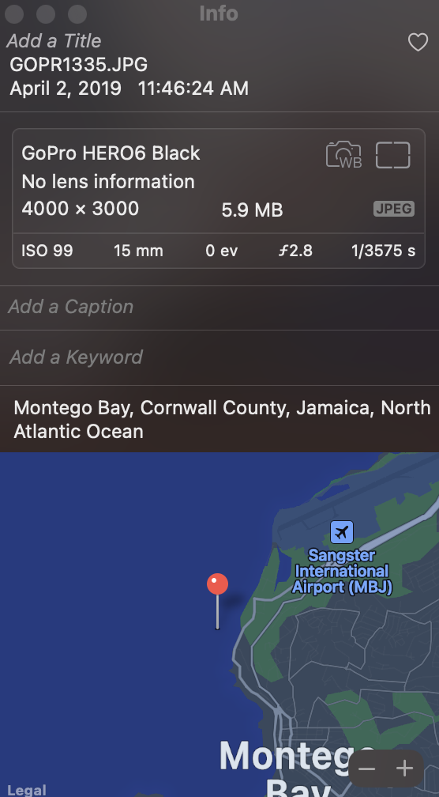
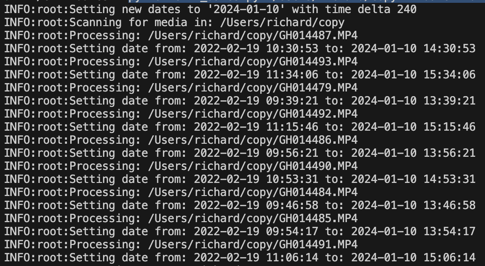

When we started to travel more extensively as a family I wanted to get a GoPro. I thought that it would be worthwhile for capturing moments we normally couldn't get with a regular camera or phone. I ended up purchasing the [Hero 6 Black](https://www.amazon.com/GoPro-HERO6-Black-Waterproof-Digital/dp/B074X5WPC5) which was the newest model at the time. I've used it on several of our vacations and we've got a trip coming in the fall where I'll likely use it again. It is especially handy while in the water. I've captured some really great moments like the one below.

<iframe
  width="560"
  height="315"
  src="https://www.youtube.com/embed/IRFGZpP04MQ?si=lbEt5v6q0TmvDBIw"
  title="YouTube video player"
  frameborder="0"
  allow="accelerometer; autoplay; clipboard-write; encrypted-media; gyroscope; picture-in-picture; web-share"
  allowfullscreen
></iframe>

## Date Issues

I've had an annoying issue with my GoPro though. Any time a camera isn't used for an extended period of time the date and time can get off. If I haven't used my GoPro in a while and then use it before either manually setting the time or syncing the camera with my phone then the date embedded in the video are off. The date on the camera and the recorded video is something like _January 1, 2016 at 12:00 PM_.


This happens with lots of different cameras not just this brand. A lot of people probably just live with it or aren't bothered by it. When I go back to look at vacations we've taken, those videos are not listed with the others making them hard to find.

When I first realized I had some files with this problem I started searching for a solution. At that time editing the created date in the [GoPro Quick](https://gopro.com/en/us/shop/quik-app-video-photo-editor) application changed it only in that one application. Changing the file created timestamp in the file system worked for some libraries, but not all of them. Our media library has been spread out over various devices and cloud services over the years and each library has a little bit different algorithm for figuring out timelines. So I needed to figure out a way to fix the created date everywhere we store media.

## EXIF Data

All modern devices that take photos or video embed metadata in the those files. That metadata is in a format called EXIF which stands for "Exchangeable image file format". The metadata that is embedded usually includes things like: the camera model, lens, resolution, geolocation, and created timestamp.



Changing those embedded dates is the only way I've found that fixes where these videos show up in timelines across all our media libraries.

## The Solution

There is a great command line application [exiftool](https://exiftool.org/) that can be use to view and update the EXIF data in various media file types. For example:

```shell
exiftool -d "%Y-%m-%d %H:%M:%S" -CreateDate -s -S GH014479.MP4

```

Outputs the create date tag using the passed in datetime format "2022-02-19 09:39:21" for the passed in file. It is super powerful, but not very practical for manipulating batches of files.

I wrote a python script that you can find in the [exif-dates](https://github.com/richwklein/exif-dates) repo that wraps `exiftool` specifically for updating batches of GoPro videos and photos all at once.

The script scans the passed in directory finding all _mp4_, _lrv_, _jpg_, and _thm_ files. It extracts the CreateDate from the EXIF metadata of the found files and pulls the timestamp from the date. The time delta that is passed in gets added to the extracted time. Finally, multiple metadata dates get set to the new date with the updated timestamp.

The dates that get set are: CreateDate, TrackCreateDate, TrackModifyDate, MediaCreateDate, and MediaModifyDate.

So for example if you wanted to set all the files in a directory to January 10, 2024 and shift all the times by 4 hours you call the script like:

```shell
python exif_dates.py "/Users/richard/copy" --date="2024-01-10" --delta=240
```

The output of the script lists the file being changed along with the old timestamp and the new timestamp.



The `exif-dates` script has a `dry` argument that you can be used to see what will be changed without actually making the change.

To be safe I put all the files I want to update in a separate directory making a backup of them. Then I call the script from the command line with the `dry` argument to see what the new dates will be. Once I'm satisfied with the output I remove the dry argument and let it run for real. After all the files are updated I move them back to their original locations.

Valid arguments to the script are:

- directory: Full path to the directory to process.
- date: New date in the YYYY-MM-DD format.
- delta: Time delta in minutes.
- dry: Execute as a dry run with no updates.

## Conclusion

I wrote the **exif-dates** script to scratch my own itch and fix a problem that I was having. It has come in handy a few different times when I've figured out I had videos in the wrong spot. It is a little bit technical, but the script is publicly available if you think it might help you fix your own photos and videos.
