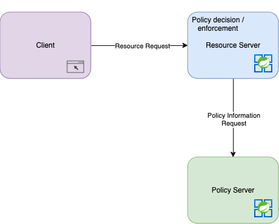

This article is the exploration of distributed authorization using the [Casbin](https://casbin.org) library. It is a follow up from a 2022 [article](2022-06-18-distributed-authorization) I published. In the previous article, I detailed various access control models, the parts of an authorization system, some typical patterns you see in those systems, and the pros and cons. This article is a promised follow up article using [Casbin](https://casbin.org).

{/* prettier-ignore */}
<Alert severity="warning">The code and and recommendations in this article has not been tested in a production environment.</Alert>

## System Architecture

I will be using some terms to describe the overall system architecture. Some of these terms come from the the [OAuth 2.0 RFC](https://www.rfc-editor.org/rfc/rfc6749#section-1.1) and the [XACML 3.0 Standard](https://docs.oasis-open.org/xacml/3.0/xacml-3.0-core-spec-os-en.html). Most of these terms were used in previous articles.

<dl>
  <dt>Resource Server</dt>
  <dd>The server hosting the protected resources.</dd>
  <dt>Policy administration point (PAP)</dt>
  <dd>The system entity that creates a policy or policy set.</dd>
  <dt>Policy decision point (PDP)</dt>
  <dd>The system entity that evaluates applicable policy and renders an authorization decision.</dd>
  <dt>Policy enforcement point (PEP)</dt>
  <dd>
    The system entity that performs access control, by making decision requests and enforcing
    authorization decisions.
  </dd>
  <dt>Policy information point (PIP)</dt>
  <dd>The system entity that acts as a source of attribute values.</dd>
</dl>

The system I'm going to design will use a **Local Decision / Centralized Policy** pattern where the Policy decision and Policy enforcement points will reside within the Resource Server and there will be a central server responsible for the Policy administration and Policy information points. The resource server will make rest requests to retrieve policy data from the authorization server. It will then cache that data in it's own database to do make local authorization decisions. These services will be built using Java 21 and Spring Boot 3.x.



## Resource Server

This section shows how to build our "Resource Server" which will be a research paper submission system. We'll secure a Spring Boot service using Okta for Authentication and Casbin for Authorization, leveraging Spring Security’s AuthorizationManager for method-level security. Our server could be horizontally scaled where there could be multiple instances of it. In a real world system there could be lots of different kinds of resource servers deployed as part of an overall system.

### Okta Authentication

The main focus of this article will be on Authorization / Access Control. One of the first steps in any type of authorization check should be to first establish if the request is authenticated. In this guide I'm going to have all endpoint require a user to be authenticated. That responsibility will be left up to Spring Security and Okta.

I created a new Spring Boot project using Gradle as the build system via Spring Initializr. I'm using lombok to do boilerplate code generation and added the Okta starter. You will need an Okta Developer account to get the configuration that needs to go in the application.yaml file. Baeldung has a great [tutorial](https://www.baeldung.com/spring-security-okta) that can walk you through that process.

```kts
dependencies {
	compileOnly("org.projectlombok:lombok:1.18.34")
	annotationProcessor("org.projectlombok:lombok:1.18.34")

	implementation("com.okta.spring:okta-spring-boot-starter:3.0.7")
	implementation("org.springframework.boot:spring-boot-starter-web")
}
```

```yaml
okta:
  oauth2:
    issuer: https://YOUR_OKTA_DOMAIN/oauth2/default
    client-id: YOUR_OKTA_CLIENT_ID
    client-secret: YOUR_OKTA_CLIENT_SECRET
    redirect-uri: /authorization-code/callback
```

## Casbin Basics

[Casbin](https://casbin.org) is an authorization library that supports modeling various types of access control mechanics, including: <abbr title="Access Control List">ACL</abbr>, <abbr title="Role Based Access Control">RBAC</abbr>, <abbr title="Attribute Based Access Control">ABAC</abbr>, and others. This library was original developed in the Go language, but has several different ports including <a href="https://github.com/casbin/jcasbin">jCasbin</a>, a java version, which we will be using in this article.

The library works on two sets of data to determine authorization. The first piece of data is the access control model that has been defined in a <abbr title="Policy, Effect, Request, Matchers">PERM</abbr> metamodel. The second set of data is the stored policy data / information.

### PERM Model

The access meta model or _model_ is how the type of access control that will be enforced is defined. The research paper submission system will use a variation of RBAC and ACL model for it's authorization. Below is the model that is going to be used. These models do not change vary often. The authorization server will store the model in a `conf` file. This is something that the resource server can retrieve and store locally as part of a CI/CD build process.

```ini
[request_definition]
r = sub, obj, act

[policy_definition]
p = sub, obj, act

[role_definition]
g = _, _

[policy_effect]
e = some(where (p.eft == allow))

[matchers]
m = g(r.sub, p.sub) && keyMatch3(r.obj, p.obj) && r.act == p.act
```

**The first section is the _Request definition_**. This defines the parameters of a request. The parameters will then be used by the rest of the sections to determine how the access control is enforced. This request definition is a tuple consisting of the "Subject" making the request, the desired "Object" being requested, and the "Action" being taken on the object.

```ini
[request_definition]
r = sub, obj, act
```

**The second section is the _Policy definition_**. This defines the name and order of the fields in the [Policy](#policy). The policy definition in this ACL model is "Subject", "Object", and "Action". Additionally, the "Effect" could result could be defined as well. If effect is not included then the result will be allow by default. In Casbin the _Policy_ is the policy information or policy data.

```ini
[policy_definition]
p = sub, obj, act
```

{/* TODO nail down what our policy looks like here */}

```csv

author, /papers/, GET
author, /papers/, POST
author, /papers/{id}, PATCH
reviews, /papers/, GET
reviewer, /reviews/, POST
reviewer, /reviews/{id}, PATCH
```

These policies show that an _admin_ can get all papers and then create a review. An _author_ can create and _edit_ a paper and a reviewer can update a review. In this case the policy definition use the role as the subject, the rest endpoints as the object, and the http method as the action.

**The third section is the _Role defintion_**. A role will contain two subjects and is used to match the subject from the request definition to the policy definition.

```ini
[role_definition]
g = _, _
```

```csv
rich, admin
alice, author
bob, reviewer
```

**The fourth section is the _Policy effect_**. This returns a boolean value if the "Action" should be allowed based on the matched [Policy](#policy). In the above model the request would be allowed if some matched policy effect is to allow. Consider another effect:

`e = some(where (p.eft == allow)) && !some(where (p.eft == deny))`

In this case the "Action" would be allowed if there is a matched allow policy and no matched deny policy.

**The last section is the _Matchers_**. This defines how Policy gets matched to a Request. In the above model the Policy would match if the Request "Subject" has a role that matches the Policy "Subject", the Request "Object" has a KeyMatch3 to the Policy "Object", and "Action" matches between the Request and the Policy. The _KeyMatch3_ is a built in function to match a Restful path with a `{}` in the pattern.

```ini
[matchers]
m = g(r.sub, p.sub) && keyMatch3(r.obj, p.obj) && r.act == p.act
```

### Policy Storage

Casbin provides several types of adapters for storing policy data. The authorization server we will build will use a `jdbc` adapter to store the policy in a database. We will create a custom HTTP adapter to retrieve the policy data for the resource server. The `casbin_rule` table structure for the policy data is.

```sql
CREATE TABLE casbin_rule (
    id INT NOT NULL AUTO_INCREMENT,
    ptype VARCHAR(100),
    v0 VARCHAR(100),
    v1 VARCHAR(100),
    v2 VARCHAR(100),
    v3 VARCHAR(100),
    v4 VARCHAR(100),
    v5 VARCHAR(100),
    PRIMARY KEY (id)
);
```

This `casbin_rule` table will store Casbin policies, where:

- ptype represents the type of rule (e.g., p for policy or g for group).
- v0-v5 represent different elements of the policy (subject, object, action, etc.).

## Data models

The research paper submission system will require two JPA entities. For the purposes of this article the application will use the in-memory **H2** database to store our models.

{/* prettier-ignore */}
<Alert severity="info">Some sort of managed relational database would likely be used in a real-world implementation.</Alert>

```kts
	implementation("org.springframework.boot:spring-boot-starter-data-jpa")
	runtimeOnly("com.h2database:h2")
```

```yaml
spring:
  datasource:
    url: jdbc:h2:mem:research;DB_CLOSE_DELAY=-1;DB_CLOSE_ON_EXIT=FALSE
    driver-class-name: org.h2.Driver
    username: sa
    password: password
  jpa:
    hibernate:
      ddl-auto: update
    show-sql: true
```

One entity is the paper that is submitted, reviewed, and then either accepted or rejected.

```java
@NoArgsConstructor
@Getter
@Setter
@Entity
@Table(name="paper")
public class PaperEntity {

    @Id
    @GeneratedValue(strategy = GenerationType.UUID)
    private UUID id;

    private String title;
    private String content;

    // principal id
    private String author;

    @Enumerated(EnumType.STRING)
    private PaperStatus status;
}
```

The second entity tracks reviews on the paper.

```java
@Entity
@Table(name="review")
@Builder
@Getter
public class ReviewEntity {

    @Id
    @GeneratedValue(strategy = GenerationType.UUID)
    private UUID id;

    @ManyToOne
    private PaperEntity paper;

    private String reviewer;

    private String comments;
    private boolean approved;
}
```
