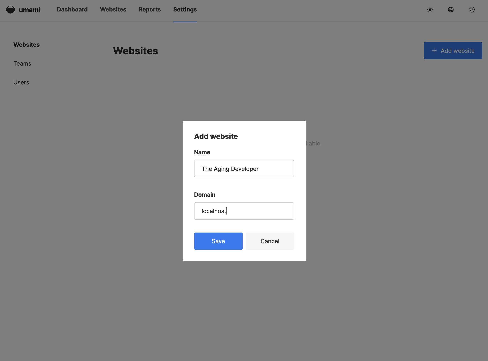
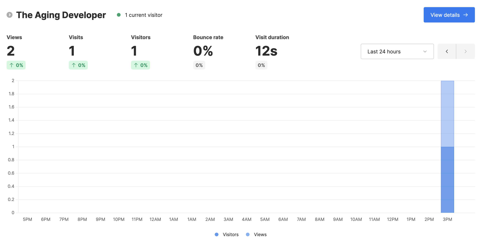
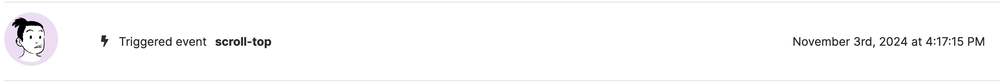
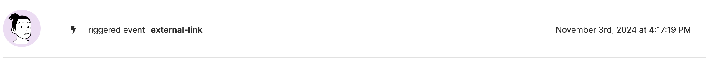

I’ve recently been exploring different analytics platforms, and during my research, I came across _Umami_—an open-source, privacy-focused analytics tool that serves as a powerful alternative to Google Analytics. By default it does not collect any personal information and all data is anonymized.

I had the chance to create a proof-of-concept using _Umami_, and I thought it would be valuable to share my experience. To demonstrate the usage of _Umami_, I'm going to replace this sites current analytics implementation with one based on _Umami_.

## Server Setup

The first step is setting up a server to collect analytics. Umami offers a [cloud version](https://umami.is/pricing) with various pricing options, including a free tier for hobby sites. Alternatively, you can host Umami on your own server; all you need is a database and server. There are several guides available for [self-hosting](https://umami.is/docs/guides/hosting). Since this is just a demonstration, I'll be running the database and Node.js server locally using Docker.

### Step 1: Clone the Umami Repository

To get started, pull the latest source code from the Umami repository using Git:

```shell
git clone https://github.com/umami-software/umami.git
```

### Step 2: Start the Docker Containers

Next, use Docker Compose to start the Docker containers with PostgreSQL support:

```
docker compose up -d
```

### Step 3: Access the Umami Dashboard

Once the Docker containers are up and running, navigate to the local address where the server is running, `http://localhost:3000`. Log in with the default credentials:

- Username: admin
- Password: umami

### Step 4: Add a Website to Track

After logging in, create a website by navigating to _Settings > Website_ and clicking the "Add Website" button. For this example, I'm using **The Aging Developer** as the site name and `localhost` as the domain, since this is a local demonstration. Be sure to enter your actual domain if you're setting this up for a live site.



### Step 5: Retrieve the Tracking Code

Once the website is saved, click the "Edit" button next to it, then go to the _Tracking Code_ tab. This tab contains a script that needs to be inserted into the site’s HTML to start tracking visits. I'll modify this script in the next section to work with the _Astro_ framework this site is built on.

```html
<script
  defer
  src="http://localhost:3000/script.js"
  data-website-id="46903d23-08ec-4519-9bb2-d6594f1110fa"
></script>
```

## Start Tracking

In _Astro_ components, scripts are hoisted and loaded as JS modules by default. To ensure that our tracking script runs inline and does not get hoisted, we need to modify it accordingly. This script will be placed in the `<head>` of the page, which is located in the `Layout` component. In a production environment, I recommend moving the "website-id" into an environment variable and using that in the data-website-id property.

```html
<script
  is:inline
  async
  src="http://localhost:3000/script.js"
  data-website-id="46903d23-08ec-4519-9bb2-d6594f1110fa"
></script>
```

With that script in place, _Umami_ will automatically start capturing page views. After starting the Astro local development server with `npx astro dev` and navigating to this article in progress, I received two page view events.



## Custom Events

In addition to basic page views, I also want to track clicks on outbound links and instances when a user utilizes the action button to scroll back to the top of the page, using two different techniques.

### Scroll Top

The `ScrollTop` component is a button wrapped in a custom HTML element. This button already has a click listener attached to it. To implement custom tracking, I simply added a call to the tracking function within the listener.

```jsx
const button = this.querySelector('button')
button?.addEventListener('click', () => {
  window.umami.track('scroll-top')
  window.clearTimeout(timer)
  window.scrollTo({ top: 0, left: 0, behavior: 'smooth' })
})
```



### Outbound Links

Another powerful way _Umami_ allows you to track events is by using a data property that specifies the event name. I created an Astro component called `LinkExternal`, which serves as a wrapper for all links to external sites. This component includes some default properties already set.

```jsx
<a
  data-link="external"
  data-umami-event="external-link"
  target="_blank"
  rel="noopener noreferrer"
  href={to}
  class:list={[className]}
  title={title}
>
  <slot />
</a>
```



If I wanted to track additional dimensions for this event, such as the URL being navigated to, I could use a click handler in conjunction with the tracking function.

## Conclusion

As you can see, it is relatively quick and straightforward to start collecting metrics for your site while utilizing an open-source library that helps you stay privacy-focused.
