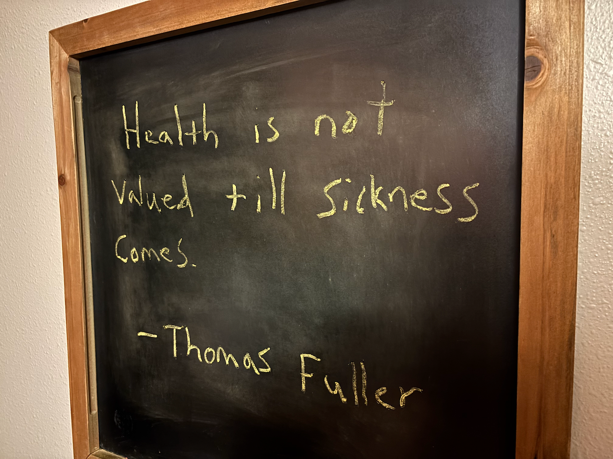

When I had my original website, it felt like a way to share pieces of my life that meant the most. Back then, I often posted quotes that resonated with me, ideas I wanted to hold onto or share with others. But when Rachel hung the chalkboard in our kitchen, it quickly became my favorite canvas. I'd carefully choose a quote each week that captured our mood, our milestones, or simply a lesson worth remembering.



I wanted to bring that same spirit to this site. Sharing those chalkboard quotes online felt like a way to extend our kitchen beyond its walls, letting others connect with the moments and meaning that shaped our family. Sometimes, I imagine visitors reading those quotes and trying to guess what's going on in our lives — what event, challenge, or joy might have inspired the words that week.

The virtual quote board is officially live. You'll find it just below the lead article, featuring the most recent quote pulled straight from our kitchen chalkboard. Clicking on it will take you to a page with past quotes—a growing collection of the words we've shared here. These don't go all the way back to when I first started jotting them down on the board, but they do go back to when I first decided to share them online. It's a small but meaningful step in capturing the moments that shape us.

[](/#quote-card-lead)

So how did the Virtual Quote Board come to life?

## Upgrading to the Latest Astro Framework

This site is built using the Astro framework, which initially had a somewhat rigid content layer for defining data. Originally, I would have needed a separate file for each quote—something I wanted to avoid. Fortunately, Astro 5.0 introduced updated content APIs that allowed me to consolidate all the data into a single file, making the process far more efficient. I've mentioned before that [major version updates can be risky](./2022-02-26-major-harmful), and the upgrade from Astro 4.x to 5.x was no exception. It required modifying 49 files along the way, but the end result was worth the effort.

## Defining the Quote Content Collection

The Astro `defineCollection` method is used to define a content collection. It requires a `loader` function to load the data and a `schema` function to define the structure of the data within the collection. For this, the `Zod` library is used to define and validate the schema.

```ts
const quote = defineCollection({
  loader: file('src/content/data/quote.json'),
  schema: () =>
    z.object({
      text: z.string().min(1, 'Quote text cannot be empty'),
      author: z.string().min(1, 'Author name cannot be empty').default('Anonymous'),
      chalked: z
        .string()
        .date()
        .transform((val) => new Date(val)),
    }),
})
```

The schema above represents the structure I created for the quotes. The data is stored in an array within a single JSON file, where each entry contains a quote. Each quote consists of the text, the author's name, and the date it was written on the chalkboard. If the author's name is left out, it defaults to "Anonymous," ensuring that the entry is still valid without requiring additional edits.

I chose the property name "chalked" because it felt most representative of the context. Initially, I considered "published," but that seemed ambiguous—it could imply the date the original author published the quote or the date it was published on this site. "Chalked" captures the essence of when the quote first appeared on our kitchen chalkboard.

I considered adding a source citation property, but much of the time, I'm unfamiliar with the origins of the quote.

## Designing the Quote Card Components

When displaying quotes, I wanted to use the most semantically correct HTML tags to ensure both accessibility and proper structure. I based my approach on the CSS-Tricks [article](https://css-tricks.com/quoting-in-html-quotations-citations-and-blockquotes/#aa-hey-what-about-the-figure-element) about quoting in HTML. Following this guidance, I structured the quote text inside a `<blockquote>` element nested within a `<figure>`. The author is included in a `<figcaption>` for proper attribution, and the "chalked" date is displayed using a `<time>` element for semantic clarity.

Here's an example of the markup:

```astro
<figure>
  <blockquote class:list={['text-3xl tracking-wide']}>
    {quote.data.text}
  </blockquote>
  <figcaption>&mdash;&nbsp;{quote.data.author}</figcaption>
</figure>

<time datetime={quote.data.chalked.toISOString()} class:list={['mt-4 block']}>
  {formatDate(quote.data.chalked)}
</time>
```

This structure ensures the content is both visually appealing and easy to interpret for assistive technologies. By combining semantic HTML with thoughtful styling, the quotes are presented in a way that feels intentional and polished.

I settled on two variations for displaying quotes, both using the same semantic markup as shown above. On the historic quotes page, the design takes a simple approach with a card outline, utilizing the standard fonts and colors consistent with the rest of the site. For the **lead** variation displayed on the home page, I wanted it to evoke the feel of an actual chalkboard and link to the historic page. To achieve this, I incorporated a chalkboard background image, a thick yellow border, and a font styled to resemble chalk.

```astro
<div
  id="quote-card-lead"
  class:list={[
    'bg-black bg-[url("../content/image/chalkboard.jpg")] bg-cover bg-left-top',
    'font-chalk text-base text-slate-300',
    'rounded-md border-4 border-yellow-600',
    'flex h-full min-h-40 flex-col justify-between p-4',
    className,
  ]}
>
</div>
```

The `font-chalk` class specifies a custom font family defined in my Tailwind configuration:

```ts
chalk: ['Walter Turncoat', ...defaultTheme.fontFamily.sans],
```

The font, **Walter Turncoat**, was downloaded and installed from [fontsource.org](https://fontsource.org/fonts/walter-turncoat). It is a playful, chalk-like style that adds the perfect touch to bringing the chalkboard theme to life.

## Integrating Quote Components Across the Site

I integrated the quote components into two key pages: the home page and the historic quotes page. The home page highlights the most recent quote, while the historic page lists all quotes in descending order based on their chalked dates. To manage this functionality, I created two utility methods to retrieve and sort the quote data.

```ts
export const getQuotes = async (limit?: number, exclude?: string): QuotesResponse => {
  const quotes = await getCollection('quote')
  return quotes
    .filter((quote: CollectionEntry<'quote'>) => quote.id != exclude)
    .sort(
      (a: CollectionEntry<'quote'>, b: CollectionEntry<'quote'>) =>
        b.data.chalked.valueOf() - a.data.chalked.valueOf()
    )
    .slice(0, limit)
}

export const getLatestQuote = async (): Promise<CollectionEntry<'quote'>> => {
  const [latest] = await getQuotes(1)
  return latest
}
```

- **`getQuotes` Method**: This retrieves all quote entries from the collection and sorts them by their chalked dates in descending order. It can accept an optional `limit` parameter to specify the maximum number of quotes to return and an `exclude` parameter to filter out a specific quote by ID. The method returns an array of quotes based on these parameters.

- **`getLatestQuote` Method**: This leverages the `getQuotes` method with a limit of one, returning the most recent quote as a single entry.

With those two methods defined, wiring up the components becomes straightforward. Below is an example of how the lead quote component is integrated into the home page:

```astro
---
/**
 * The home page with a lead article and most recent.
 */
import ArticleCardLead from '@components/ArticleCardLead.astro'
import ArticleGrid from '@components/ArticleGrid.astro'
import BackLink from '@components/BackLink.astro'
import QuoteCardLead from '@components/QuoteCardLead.astro'
import Layout from '@layouts/Layout.astro'
import { getArticles } from '@utils/article'
import { getLatestQuote } from '@utils/quote'
import { getDefaultSite } from '@utils/site'

const articles = await getArticles(9)
const site = await getDefaultSite()
const data = site.data
const lead = articles.shift()
const latest = await getLatestQuote()
---

<Layout site={site}>
  {lead ? <ArticleCardLead article={lead} /> : null}
  <QuoteCardLead quote={latest} class:list={['mt-4']} />
  <ArticleGrid articles={articles} foldCount={4} class:list={['mt-4']} />
  <BackLink name="articles" to={'/article/archive-1'} class:list={['mt-4']} />
</Layout>
```

## Bringing Quotes to Life Online

Developing this feature was both fun and meaningful, offering a little glimpse into the moments that shape life in our house. By sharing these quotes online, I hope to capture some of the spirit behind our family's kitchen chalkboard while making the content easy to explore.

If you're curious about the technical details, the site's code is open source and available online. You can check out the [pull request](https://github.com/richwklein/agingdeveloper/pull/715) for this feature, along with this article, at the project's repository: [agingdeveloper on GitHub](https://github.com/richwklein/agingdeveloper).
