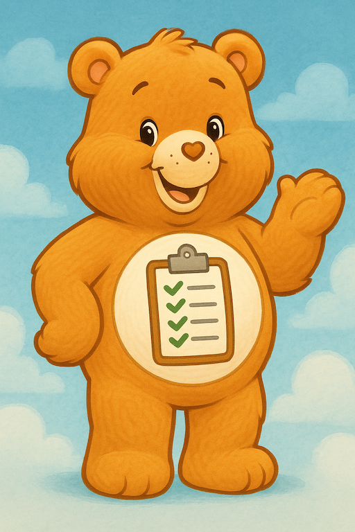

I'm not an expert in AI or prompt engineering, but I do use AI tools regularly in both my personal and professional life. Along the way, I've learned a few things worth sharing. These simple strategies can help you get better results when using tools like ChatGPT.

The examples in this article come from a real planning session with [ChatGPT](https://chatgpt.com/) to find a family vacation spot for the fall.

---

## Use Clear and Specific Language

Avoid vague or ambiguous terms in your prompts. The clearer and more specific you are, the better the AI can understand what you're asking for. Instead of saying "Tell me about vacation spots," try to be more specific: "List five vacation destinations."

## Set the Tone or Style You Want

If you're looking for responses in a particular tone (professional, friendly, casual, or funny) just say so. The AI will adapt its wording to match.

```
Write your response in a casual tone, like you're talking to a friend.
```

## Employ the CARE Method

I wanted to have a little fun with this article, so I had ChatGPT created a CARE Bear to help illustrate the CARE method. The CARE method is a mnemonic to help you remember how to structure your prompts. It stands for: Context, Ask, Rules, and Examples.



The bear is here to remind you to be clear, ask specific questions, set rules, and provide examples when crafting your prompts.

### Context

_Give background information that sets the scene_. This gives the AI a better understanding of what you're looking for. Include giving the AI a specific job title or role to play. So, instead of just asking "Where can my family go on vacation?", you could set up the context by saying:

```
You are a travel agent specializing in vacation destinations in the United States.
```

### Ask

_Clearly state what you want the AI to do or answer_. Be direct and specific in your request. For example, instead of saying "Tell me about vacation spots," you could ask:

```
What are five vacation destinations for a family trip? include details about the drive time, weather, and activities.
```

### Rules

_Add any requirements or limitations_. This helps narrow down the options and ensures the AI's response aligns with your needs. For my vacation planning prompt, I added:

```
The destination should be around a 10-hour drive from Iowa. A stop in Rolla, MO should not extend the drive time beyond an additional hour. The weather should be warmer than Iowa in late November. The destination should be family-friendly and have activities for a 15-year-old and two young adults.
```

### Examples

_Include sample inputs or outputs to illustrate what you're looking for_. These help the AI tailor its answers to your needs.

```
An example of a suitable destination is Austin, Texas. It has warm weather in late November, is family-friendly, and has activities for teenagers and young adults.
```

## Iterate and Refine

If the AI doesn't give you exactly what you need, don't worry. Rephrase your prompt, add more detail, or ask follow-up questions to guide the conversation.

```
Can you provide more details about the activities available?
```

## Ask the AI to Improve Your Prompt

You can even ask the AI for help crafting better prompts! Try asking:

- "How can I rephrase this prompt to get better results?"
- "What additional information should I include to make this clearer?"

This is a great way to learn what the AI needs in order to give more helpful answers.

## Reuse Prompts That Work

If you find a prompt that gives you great results, save it! You can reuse good prompts for similar tasks or adapt them slightly for new situations. Think of them as templates for future conversations.

**Bonus Tip**: Start a running document of your best prompts for common tasks such as writing emails, planning events, or summarizing documents.

---

## Conclusion

You don't need to be an AI expert to get great results. By using clear language, setting the tone, and applying the CARE method, you'll get more accurate and useful responses from AI tools like ChatGPT. Treat it like a conversation by asking follow-up questions and clarify your needs. When you find prompts that work well, save them and reuse them as templates.

The key is to be thoughtful and specific. And don't be afraid to experiment.

**Happy prompting!**
