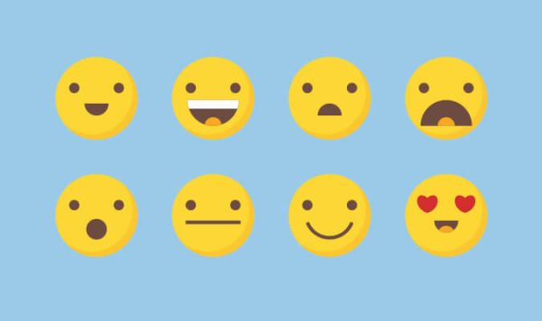
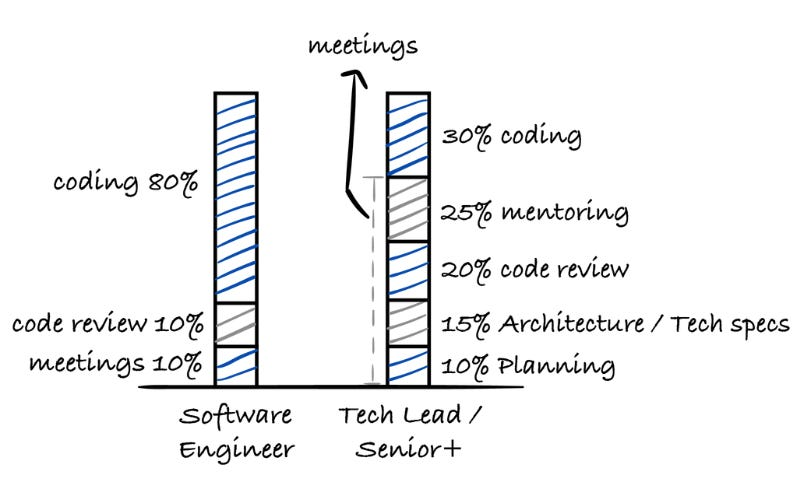

Most engineering teams don't fail because they lack information. They fail because the context lives in someone's head.

As work has shifted toward remote and async-first collaboration, written communication has become the primary interface between humans. Pull requests, issue comments, and Slack threads are more than just artifacts. _They are the work._ Written text is a lossy medium. It strips away tone, intent, urgency, and emotional nuance. Signals humans rely on to collaborate effectively.

This isn't a new observation. What _is_ new is the scale at which we experience it.


### Async by Default, Ambiguity by Accident

Async communication breaks in boring, predictable ways. Without real-time feedback loops, small ambiguities in tone and intent balloon into larger misunderstandings:

- Feedback that reads harsher than intended
- Unclear intent (“Is this a suggestion or a blocker?”)
- Increased cognitive load for readers trying to infer subtext

At staff+ levels, like Staff Engineer or Principal Engineer roles where influence extends beyond a single team, these issues compound fast because your comments travel further than you do. You're often reviewing work across teams, time zones, and domains. You don't always have the luxury of synchronous clarification. Every extra ounce of ambiguity slows decision-making and chips away at trust.

This is where emojis began to matter, not as decoration but as **contextual signals**.

### Emojis as Social and Emotional Metadata

I've come to think of emojis as a kind of shorthand for tone—the stuff you'd normally get from a raised eyebrow or a pause. Linguists and communication researchers increasingly describe emojis as a form of _paralinguistic_ information, the digital equivalent of facial expressions, gestures, and tone of voice. In other words, they don't replace words; they help shape how those words are interpreted.

That framing matches my own experience, and research backs it up:

- Studies of developer communication on GitHub show that emojis are most often used to express sentiment or soften critique—especially in comments where tone matters most. [^1]
- More broadly, research has found that emojis act as emotional signposts, helping readers more accurately interpret a writer's attitude. [^2]
- In longer-running communities, emoji usage also correlates with higher engagement and lower dropout rates. [^3]

They function a bit like log levels for conversation: small signals that help the reader calibrate how much weight or urgency to assign to what follows.

They quietly answer questions like:

- How should I read this?
- How strongly does the author feel about this point?
- Is this encouragement, concern, or caution?

All without adding another paragraph.



## Why This Matters for Engineering Leaders

For staff+ engineers, communication isn't just about correctness. It's about keeping **work moving and people aligned**.

In async environments:

- Small misunderstandings can stall progress for hours or days
- Review feedback that feels sharp—even unintentionally—can discourage contribution
- A lack of visible acknowledgment can make collaborators feel unseen

I've spent months trying to push a plan forward after a request for discussion that never quite landed. In an async environment, silence is rarely neutral. Used intentionally, emojis can help close these gaps by restoring some of the **human context** that text-only communication strips away.

Emojis didn't become important because teams became more casual. They became important because teams became more distributed, more async, and more dependent on written communication to carry both technical and social meaning.



## Emojis in Pull Request Comments

Pull request comments sit at an uncomfortable intersection. They are technical, evaluative, and often time-constrained, but they are also deeply human. This is where people give feedback, challenge decisions, acknowledge effort, and negotiate trade-offs—all without the benefit of tone, timing, or immediate clarification.

At scale, PR comments become one of the highest-risk surfaces for miscommunication in an async workflow.

## The Hidden Cost of Ambiguity in Code Review

Most teams understand the mechanics of good code review: be clear, be respectful, focus on the code, not the person. What's harder is managing how feedback is **received** when it's read hours later, out of context, and often alongside other competing priorities.

A short comment like:

> “This logic is unnecessary.”

may be intended as a neutral observation. Without additional signals, it can easily read as dismissive or overly sharp. Engineers—especially those earlier in their careers or working outside their primary domain—tend to fill in missing context pessimistically.

This is where emojis become useful—not as decoration, but as **intent markers**.


## Emojis as Intent and Tone Signals

Research into developer communication shows that emojis are most frequently used to convey sentiment, soften critique, or reinforce intent—particularly in comments where tone matters most. [^1]

Rather than replacing written feedback, they help shape how that feedback is received.

In practice, this shows up in small but meaningful ways:

- 💡 signals a suggestion, not a blocker
- 👍 acknowledges understanding or agreement without adding noise
- 👀 indicates active review, reducing uncertainty during longer feedback cycles

These cues help answer an unspoken question every reader has: _How should I read this comment?_

Studies outside software engineering support this effect. Research on emoji interpretation shows that emojis function as emotional signposts, helping readers more accurately infer a writer's attitude and reducing the likelihood of negative misinterpretation. [^2] In technical discussions, where precision matters and emotional context is sparse, that additional signal carries disproportionate value.

## The Risk of Unshared Meaning

Emojis are not self-documenting. The same emoji can mean different things to different people, teams, or cultures. A 👀 may read as “I'm reviewing” to one person and “I'm skeptical” to another. A 🔥 might signal enthusiasm, urgency, or risk, depending on context.

Without shared expectations, emojis can introduce a new layer of ambiguity rather than removing one.

At higher levels, this matters even more. Your comments carry more perceived weight, and small signals can be over-interpreted.

## Why Shared Conventions Matter

The value of emojis in pull request comments doesn't come from the symbols themselves. It comes from **shared understanding**.

When teams align on what certain emojis mean, they become a lightweight vocabulary for intent, tone, and status. Research suggests that consistent emoji usage correlates with higher engagement and lower dropout rates in remote communities—benefits that depend on predictability and shared norms. [^3]

Used this way, emojis function like any other engineering convention: they reduce cognitive load by making intent explicit.

## Making the Convention Part of the Workflow

On my team, we adopted an existing, community-maintained reference: the **Code Review Emoji Guide**.

https://github.com/erikthedeveloper/code-review-emoji-guide

What makes this guide useful isn't the emojis themselves, but the clarity of intent behind them. A 🔧 signals a required change. A ❓ marks a clarifying question. A ⛏ identifies a non-blocking nit.

Rather than relying on tribal knowledge, we linked the guide directly from our pull request template:

```markdown
## Code Review Guidance

We use a shared emoji legend to clarify intent in review comments.
Please refer to the Code Review Emoji Guide:
https://github.com/erikthedeveloper/code-review-emoji-guide

Common signals:

- :wrench: — Change requested
- :question: — Clarifying question
- :pick: — Minor nitpick
- :seedling: — Suggestion for future consideration
- :smiley: — Positive feedback or acknowledgment
```

Embedding this guidance directly into the PR flow made emoji usage intentional rather than performative. Over time, it became part of the team's review culture.

## Small Signals, Durable Teams

As engineering teams continue to operate asynchronously, the quality of our written communication matters as much as the quality of our code. Pull requests are no longer just a review mechanism; they are a primary place where trust, shared understanding, and technical judgment are built.

Emojis, used intentionally, help carry context that plain text often loses. They are not a substitute for clear writing or thoughtful feedback. They are small signals that shape how feedback is received and acted upon.

The emojis I reach for most often reflect that mindset. The 🌱 seedling, 🏕️ camping, and 📌 pushpin let me suggest cleanup, refactoring, or future improvements without turning every observation into a required change.
That distinction matters. It keeps reviews focused. It respects momentum. And it creates space for improvement without blocking delivery.

At this level, it's not really about emojis. It's about building systems where feedback moves without friction, preserves clarity, and helps teams move forward with confidence. Emojis just happen to be a lightweight, human tool that supports those goals when used with care.

Small conventions, applied consistently, can materially improve how teams collaborate. Emojis are one such convention. Used well, they help make async work not just tolerable, but sustainable.

---

[^1]:
    Cao, J., Lu, J., Guo, Z., Li, S., & Chen, X.  
    _A First Look at Emoji Usage on GitHub: An Empirical Study._  
    https://arxiv.org/pdf/1812.04863.pdf

[^2]:
    Miller, H., Thebault-Spieker, J., Chang, S., Johnson, I., Terveen, L., & Hecht, B.  
    _“Blissfully Happy” or “Ready to Fight”: Varying Interpretations of Emoji._  
    https://dl.acm.org/doi/10.1145/2858036.2858380

[^3]:
    Riordan, M. A.  
    _Emojis as Tools for Emotion Work in Computer-Mediated Communication._  
    Summary: _Emojis help remote workers stay engaged and reduce dropout._  
    https://www.eurekalert.org/news-releases/940515
