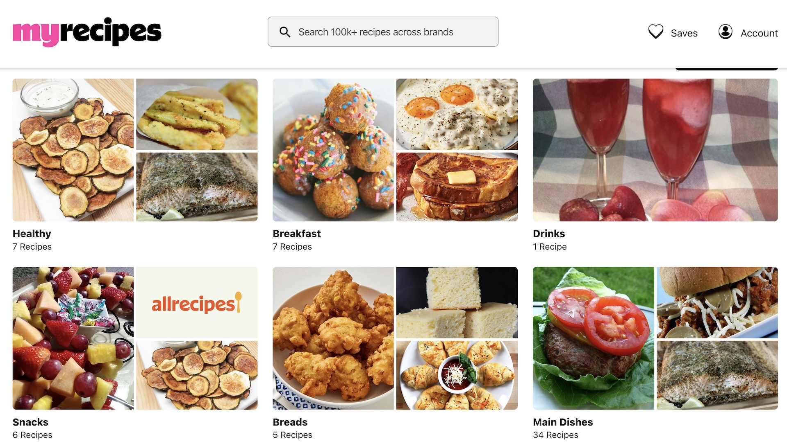
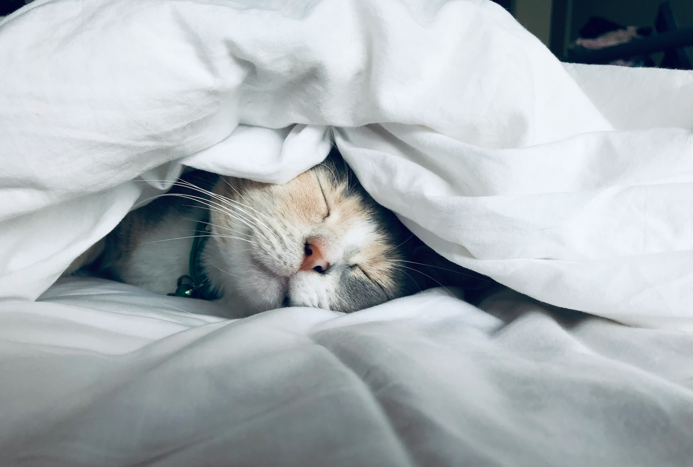

As a software engineer, staying healthy can be a real challenge. Long hours in front of a screen, the demands of deep focus, and the mental load of context-switching do not exactly lend themselves to great habits. Add in the complexity of working across time zones with a shortened lunch break, and it's easy to see why health often gets pushed aside.

I had planned to share this earlier in the month, but ended up writing and posting [Using AI and Awareness to Break the Bias Loop](/article/2026-01-11-breaking-bias) instead. This draft sat quietly for a bit. Then I had a conversation with Rachel that reminded me that these kinds of reflections are still worth sharing, even if they come a little later than planned.

So here it is: not a resolution, but a handful of small shifts I'm hoping to make in 2026 to feel a little more clear, focused, and grounded in both work and life.

## The Morning Reset

One shift I'm hoping to make this year is treating my morning dog walk as more than just a routine. It's already part of my day, but I want it to become a real mental reset—something that helps me start work with clarity instead of stress. Too often, I go straight from bed to laptop, especially when early meetings or messages are waiting. But I'm realizing there's value in building a buffer—something calm, consistent, and intentional.

What I want is to use that walk as a way to center myself. No podcasts, no inboxes, just a chance to breathe and think about how I want the day to unfold. It's a small window of time, but I think it could help me shift from reactive mode into something more grounded. I haven't figured it out yet, but that's the direction I'm moving toward.

## Standing Focus

I've had a standing desk for a while, but I've only used it in bursts. This year, I want to use it more consistently. I think small physical changes might help me stay more present in long stretches of work.

I'm planning to pair it with the Pomodoro Technique: 25-minute sprints with 5-minute breaks. During those breaks, I want to stand, stretch, maybe switch my desk height, or just move a little. I'm hoping that rhythm can bring some energy and intentionality back into my workdays. Especially on the ones that feel like a wall of meetings.

**I'm currently looking for a good Pomodoro timer app** — if you've got one you like, [let me know on BlueSky](https://bsky.app/profile/richwklein.bsky.social)!

## Mental Buffering

One habit I'd like to build is giving myself more mental space between tasks. Right now, I tend to jump from code to meetings to emails without a pause, and it leaves my brain feeling scattered. I'm learning that even a few minutes of transition time can make a difference.

What I want to try is using small buffers (a short walk, a quick personal task, or knocking out an easy five-minute win) before switching gears. These tiny resets could help me bring more focus and calm into the next thing, instead of dragging the last task's residue with me. It's a work in progress, but it feels like a shift worth making.

## Eating for Energy

With time zone overlap and short lunch windows, meals during the workday tend to get minimized or rushed. I want to change that. I'm trying to be more intentional about what I eat. I want to prioritize protein to stay steady through the afternoon.

I'm not following a strict plan, just trying to be smarter about prep. I use my [myrecipes.com](https://www.myrecipes.com) account to collect high-protein recipes that are quick to prep or batch friendly. That site makes it easy to save and organize the meals I actually want to eat. I'll occasionally scroll through on a slow weekend day and add a few more so I'm not defaulting to the same meals over and over. Having solid options ready makes it easier to get back to work feeling focused, not foggy.

## Cutting Back, Thinking Clearer

I've been reflecting on how alcohol fits into my day-to-day. While I'm not cutting it out completely, I do want to be more mindful. Even a single drink can mess with sleep, and lately, I've realized how much that impacts my focus, mood, and energy the next day.

So I'm hoping to experiment with cutting back and seeing how it feels over time. I'm also trying to get to bed a little earlier, with the goal of making mornings easier to show up for. This isn't about rigid rules; it's more about building a better foundation and giving myself the chance to feel clearer and more focused when I need it most.

## Final Thoughts on a Healthier 2026

I'm not aiming to do all of this perfectly. The real goal is to build habits that help me feel more present, more clear headed, and more grounded; even on the busiest days. Some of these shifts might stick, others might evolve, but they're all pointed in the direction I want to grow.

**What small changes are you making this year to stay healthy while working in tech?** I'd love to hear your strategies and tips. Feel free to share them with me on [BlueSky](https://bsky.app/profile/richwklein.bsky.social)!
