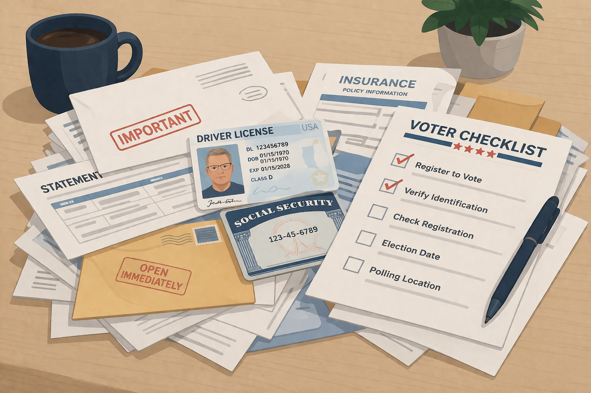

Creating an account with the IRS is one of those tasks that sounds simple until you actually try to finish it. What should have been a straightforward self-service task turned into several failed attempts, a week-long wait to get access to a live person, and then another hour on hold while I waited for the process to move forward.

It made me think about how quickly "just verify your identity" can become a slow, brittle, and exhausting process when the systems behind it fail to work the way they are supposed to.

If creating an IRS account can already be this painful, it is worth asking what similar verification burdens might look like if they were applied more broadly to something as foundational as voter registration. In this article, I explore that connection: how the IRS account process works, where it breaks down, and why that friction may offer a practical glimpse into what the **SAVE Act** could feel like in real life.

## Why the IRS Process Stands Out

This year we were getting a federal tax refund, which is unusual for us. A few weeks after filing, I received a letter in the mail saying we needed to add bank account information to our IRS account so the refund could be sent. That sounded easy enough. I already had an IRS account, so I assumed I could log in one morning, update the information, and move on with my day.

That is not what happened.

What I found instead was a process that looked modern on paper but felt brittle in practice. The IRS is now pushing people toward its [online account for individuals](https://www.irs.gov/payments/online-account-for-individuals), which is claimed to be a central place to check refunds, view notices, access tax records, and manage account details. The agency has also published material on [modernizing payments to and from America's bank account](https://www.irs.gov/newsroom/modernizing-payments-to-and-from-americas-bank-account), describing a broader push toward faster, more digital, more direct financial interactions with taxpayers. On paper, that sounds like everything I would want.

But when I tried to sign in, the account I had was no longer accessible. The login flow had changed. I also have a `login.gov` account and assumed that, because it works for other federal services, it would be accepted here too. It was not. The IRS [registration page](https://www.irs.gov/secureaccess) says the agency uses `ID.me`, a third-party digital wallet provider.[^idme-irs] So instead of simply logging into an existing government account, I had to navigate a different identity system with different requirements.

That detail matters. `ID.me` is not the IRS itself. It is a private company the federal government relies on as part of the sign-in and verification process. That creates real risks. It pushes highly sensitive identity checks and document handling through a third party, adds another gatekeeper between the public and a government service, and means that when the vendor's systems fail or reject someone incorrectly, access to the public service can fail with it. The official IRS guidance presents this as a secure, streamlined entry point, but in practice it can feel like one more point of fragility in a process that is already hard enough.

And in my case, it did not work cleanly. The self-service verification flow first required me to upload an identifying document. The screen offered several examples of documents that should work, but the only one that worked for me was my driver's license. I tried using a passport after a few failed attempts, thinking maybe the problem was the document type, but that did not get me through either.

After uploading the front and back of the document, the process then required me to enable my camera so it could scan my face and compare it against the ID. I tried this on both my computer and my phone because I started wondering whether the failure had something to do with the camera itself rather than the verification system. No luck.

And because this all started on a Thursday morning before I had showered, I eventually reached the point where I thought: maybe the problem is me. I gave up for a while, went to get cleaned up and shave, and came back later thinking maybe the system would recognize me better if I was a little less disheveled. I had also lost some weight since the photo on my ID, and I started wondering whether that played a role too. I do not know if it did, but the system gave me so little feedback that I was left guessing. What made things even more frustrating is that face recognition has not been a problem for me in other contexts, including TSA and customs.

The following day I tried again with no luck. At that point I was probably on my fourth or fifth self-service attempt. So I gave up on the automated path and decided I would have to do the "live" verification instead.

That process required me to upload a second form of identification. The examples included things like a passport, birth certificate, or Social Security card. Good thing I happened to have all of those on hand and have not changed my name. I felt lucky that these documents were with me and not sitting in a safe deposit box somewhere.

Once that second document was uploaded, I still was not actually at the live verification step. First, someone had to review the documents and decide whether they would "work" for verification. If they did not, the process implied I would need to start over with some other form of identification.

This happened on a Friday. I got an email saying I would receive another email once my documents had been verified and I could continue. That was striking, because the verification screen itself suggested the live verification process only took about 10 to 15 minutes. But instead of moving into that window, I started getting follow-up emails every three or four days saying the documents were still in queue for review.

Eventually I did receive the email saying my documents were good enough to continue and that I could follow a link to do the live verification. So I clicked the link. When I reached the next screen, it said the wait would be about 20 minutes. There was also a button to schedule a different time if I did not want to stay in line.

It actually took about an hour before I finally got connected to an agent. Once a real person was there, the process was pretty quick. I just had to have both forms of identification with me and hold each one up to the camera, one at a time, next to my face.

What should have been a routine self-service update became several failed attempts, then a week-long wait to connect with a live person, and finally another hour on hold before I could get any traction. That is a very different experience from the promise implied by the verification pages.

## Where the SAVE Act Comparison Starts

This is where I start thinking about the SAVE Act. Tax administration and voter registration are not the same thing, but they do share a similar policy instinct: if we tighten identity requirements, the system will be more trustworthy. _That sounds reasonable enough._

In Iowa today, you can [register to vote online](https://sos.iowa.gov/voters/voter-registration), but the current system is much simpler than what the SAVE Act would impose. The Iowa Secretary of State says online registration requires an Iowa driver's license or non-operator ID, and the state says the voter ID law "does not affect Iowa's voter registration process."[^iowa-registration] That is the system people are used to right now.

The SAVE Act is different. The current bill text says applicants for federal voter registration would need documentary proof of U.S. citizenship,[^save-act-proof] such as a valid U.S. passport or certain other records. It does include a narrow category for a REAL ID-compliant document, but only if that ID indicates the applicant is a U.S. citizen. Iowa DOT says its REAL ID and non-REAL ID cards contain the same information and differ physically mainly by the star marking.[^iowa-realid] This casts doubt on whether an Iowa driver's license satisfies the SAVE Act's citizenship-proof requirement. At a minimum, it is clearly not the same as today's "use your Iowa driver's license online" flow.

The IRS has been publicly framing its work in terms of modernization. Its [Taxpayer Experience strategy](https://www.irs.gov/newsroom/taxpayer-first-act-taxpayer-experience) talks about expanded digital services and a "seamless experience," and its [Taxpayer First Act modernization page](https://www.irs.gov/newsroom/taxpayer-first-act-irs-modernization) discusses stronger identity verification as part of its approach. That sounds sensible. People want secure systems. They also want online tools that do not collapse into support queues.

My experience is a reminder that those goals do not automatically arrive together. A process can be modernized in architecture and policy language and still feel punishing to the person trying to use it. If that happened to me in creating a tax account, it is fair to worry about what happens when similar verification burdens attach to something as basic as participating in elections.

## Friction Is Not Distributed Evenly

One reason this experience bothered me so much is that I know I am not the hardest case. I have stable internet access. I am comfortable with technical systems. I already had accounts with federal services. I had the time and persistence to keep trying, wait a week, and then sit on hold for an hour. Even with those advantages, the process was painful.

So what happens to someone who does not have clean documentation on hand? Someone with a name change? Someone whose records do not line up neatly across agencies? Someone who is not comfortable uploading identity documents to a private verification vendor? Someone who cannot take time off work to wait for a callback or sit on hold? Someone relying on assistive technology, even as the IRS maintains a separate [accessibility guide for online account](https://www.irs.gov/payments/accessibility-guide-for-online-account)?

This is the part that gets overlooked in a lot of policy conversations. "Just verify your identity" sounds simple, but in practice it can become a chain of dependencies: the right device, the right documents, the right records, the right provider, the right support path, and enough time and energy to survive the failures when one of those pieces breaks.

That concern grows when you look at Iowa's voter list maintenance rules. The Iowa Secretary of State says a voter's status can change if county mail is returned undeliverable. Iowa Code also allows a registration record to be made inactive and then canceled after it remains inactive through two successive general elections. In a February 3, 2025 release[^iowa-inactive], the Iowa Secretary of State said voters who did not participate in the most recent Iowa general election were marked inactive and that registrations are canceled after two consecutive general elections without voting. The same release said about 183,000 inactive voters who had not participated in an Iowa election since 2020 were marked as canceled.

Under Iowa's current system, same-day registration and updates provide a backstop. But if a SAVE Act-style proof-of-citizenship regime were layered on top of a purge process, getting knocked off the rolls would not just mean filling out another form. It could mean going back through a documentation-heavy process again, potentially in person, with the same kinds of birth certificate, passport, and name-match problems that make other identity systems so brittle.

## Final Thoughts

The IRS clearly wants more taxpayers using digital tools. It encourages [direct deposit for refunds](https://www.irs.gov/newsroom/direct-deposit-fastest-way-to-receive-federal-tax-refund), promotes online account access, and has framed this work as part of [modernizing payments to and from America's bank account](https://www.irs.gov/newsroom/modernizing-payments-to-and-from-americas-bank-account) and improving the broader taxpayer experience. I do not doubt those goals are sincere.

But sincerity is not the same thing as usability.

My experience of trying to receive a refund through the "modern" system was not seamless. It was several failed attempts, a week-long wait to reach a human being, and an hour on hold while trying to solve a problem that existed only because the happy path had broken down. That does not make identity verification illegitimate. It does mean we should be careful before building more public systems around the assumption that verification friction is minor, neutral, or evenly distributed.

If creating an IRS account can already feel like this, then it is not hard to imagine how similar requirements in other parts of civic life could lock people out in ways that policymakers never personally experience.

[^save-act-proof]: Congressional Research Service summary of the SAVE Act on Congress.gov: [Safeguard American Voter Eligibility Act (SAVE Act, H.R. 22/S. 128) and Federal Voter Registration Policy and Law](https://www.congress.gov/crs-product/IF12902).

[^iowa-inactive]: Iowa Secretary of State, [Iowa Secretary of State's Office Maintains Up-To-Date Voter Registration Lists to Keep Iowa Elections Secure](https://sos.iowa.gov/news-resources/iowa-secretary-states-office-maintains-date-voter-registration-lists-keep-iowa-0), February 3, 2025.

[^idme-irs]: IRS, [Secure Access: How to Register for Certain Online Self-Help Tools](https://www.irs.gov/secureaccess).

[^iowa-registration]: Iowa Secretary of State, [Voter Registration](https://sos.iowa.gov/voters/voter-registration) and [Voter ID Information](https://sos.iowa.gov/voters/voter-id-information).

[^iowa-realid]: Iowa DOT, [REAL ID](https://iowadot.gov/mvd/realid), explaining that REAL ID and standard cards contain the same information and differ primarily in appearance and federal use.
