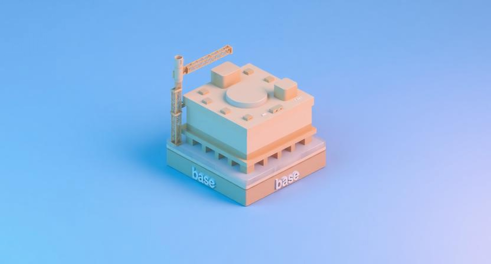
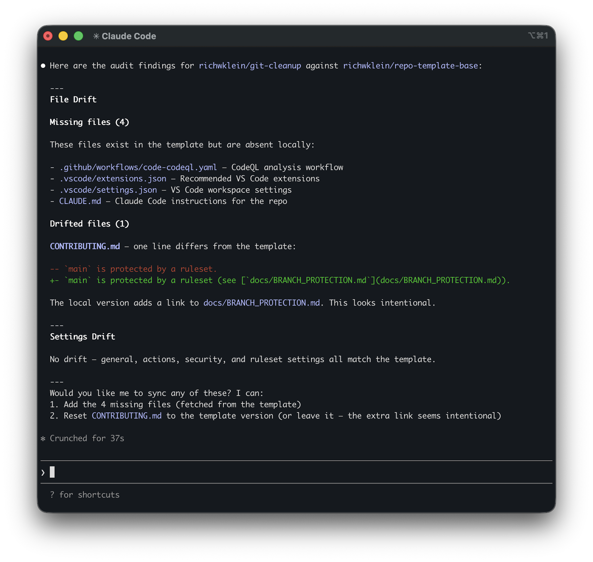

I had six active projects under my personal GitHub account and six slightly different versions of the same configuration. Some had CodeQL scanning enabled. Others did not. Two had branch protection rulesets. Three had the correct license year. The rest had whatever year I happened to create them.

What I wanted was simpler: spin up a new repo and have it just work, or switch between existing projects without the mental overhead of remembering which one does things differently. That was already hard enough across TypeScript, Python, Bash, and Swift projects. I built a system so it would be.

## Two Templates

The system has two layers. [`repo-template-base`](https://github.com/richwklein/repo-template-base) handles the shared operational layer: repository policies, GitHub automation, editor defaults, security configuration, and repo settings. [`repo-template-astro`](https://github.com/richwklein/repo-template-astro) extends it with the TypeScript and Astro layers.

Don't bother with static manifests. Define which API endpoints to check, then fetch live values from the template and diff against the target repo. The template is the **source of truth**. No separate spec to drift.

Ship both `.editorconfig` and `.vscode/settings.json` because they solve different problems. VS Code settings stay editor-specific. `.editorconfig` travels with the files themselves, so indentation, line endings, and whitespace rules stay consistent across editors and tooling.

Starting a new project from the template is a single command:

```bash
gh repo create my-new-project --template richwklein/repo-template-astro --clone
```

First time I ran this I expected to spend the morning fixing config. The repo cloned ready to use.



## What Hurt

Migrating private repos taught me to check the GitHub plan first. Branch protection and rulesets both require the paid tier. I hit this on a nonprofit site I maintain. Every other part of the migration was done. Branch protection was the one thing I could not enable.

Retrofitting `release-please` onto projects with non-conventional history meant seeding a `CHANGELOG.md` by hand, one header per prior release. There was no shortcut. I did this for every repo that had tagged releases.

The package manager choice came back to bite me. One of my projects depended on the Wix CLI, which throws an exception if it detects anything other than npm. I was on pnpm, so npm won. That decision rippled farther than I expected. The migration meant deleting `pnpm-lock.yaml`, regenerating `package-lock.json`, updating every workflow and action, and revalidating the Astro toolchain.

## The Drift Detection Skill

Don't expect the GitHub template button to keep your repos in sync. Click "Use this template" and the relationship ends at the copy. For the repos I migrated by hand, even that initial link is missing. GitHub templates solve project creation, not project maintenance. The moment I started updating the templates, every descendant became a potential fork of the "correct" version.

The audit is an agent skill: a reusable slash command backed by a Python diffing script. It compares the template against the local repo and reports missing files, drifted files, schema gaps, and settings drift.

The skill lives in a central [`richwklein/skills`](https://github.com/richwklein/skills) repo. Install it once, then invoke it from any AI Agent session inside a repo:

```bash
npx skills add richwklein/skills
```

```text
/repo-template-audit richwklein/repo-template-astro
```

Skip the template argument when the repo was created via "Use this template". GitHub stores a `template_repository` reference that the skill reads automatically. For repos you migrated by hand, pass it explicitly. That field is never set when the button is not used.

A typical report looks like this:



Keep shared skills in their own repo. I started with the skill embedded in each template and copied into descendants. That meant every descendant carried its own frozen copy, and any update meant touching every repo. Moving it to a central [`richwklein/skills`](https://github.com/richwklein/skills) repo solved that, and gave me a home for the next skill I build. Install once, get updates everywhere.

The first run on a supposedly-complete migration found seven drifted files. Some were intentional: spell-check words, coverage thresholds tied to real test counts. Two were genuine oversights I would not have caught otherwise.

The skill caught a one-word inconsistency in the templates' own `AGENTS.md` files. The base template read "still match **this** template." Every descendant that had correctly adapted the line said "still match **the** template." One word. The tool caught it, including the self-referential case where the template is auditing itself.


## Should I Have Done This Earlier?

Yes. The right time to build a template repo is after your second project, not your eighth.

By then, you are no longer standardizing. You are excavating eight variations of the same project, each made differently. The counterargument is that you cannot know what belongs in a template until you have built several projects without one. That is true. But the cost of an imperfect early template is a few days of updating it. The cost of no template is years of entropy and a week of archaeology.

**Consistency is a form of automation.** Coming back to a repo after months away, there is nothing to relearn: the workflows, editor rules, and release flow match every other project. The switching cost dropped to almost nothing.

The drift detection skill, written as code, reinforced this. It is more durable than a mental note or a shared doc. It enforces those decisions six months from now when I have forgotten making them.

## What Is Next

All my repos are migrated and the skill runs on demand. The remaining blockers are external: branch protection and CodeQL require a paid plan on any private repo, whether it is a nonprofit site waiting on GitHub's nonprofit program approval or a personal project that has not yet justified an upgrade.

The obvious next step is scheduled audits. I could make this a scheduled workflow that runs the drift check weekly and opens an issue if anything has slipped. The system only works if the drift becomes impossible to ignore. That's the next thing I'll build.
